

  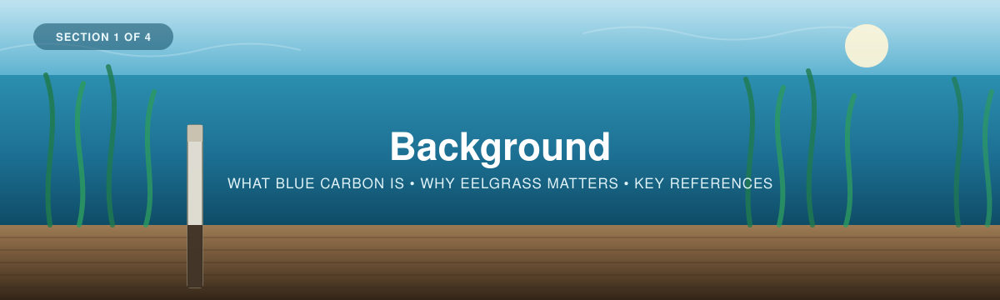

---

[← Back to main guide](../README.md) · Next: [2 — Project Planning →](../02_Project_Planning/)

---

# Part 1 — Background

*Intro to blue carbon in eelgrass ecosystems, and why sediment carbon matters.*

**Quick links:** [Workshop Presentation Slides](BlueCarbon_EelgrassPPT_FinalV1.pptx) · [WWF-Canada Coastal Blue Carbon Guide](https://wwf.ca/wp-content/uploads/2026/04/Coastal-Blue-Carbon-Field-Guide-FINAL.pdf) · [Howard et al. (2014) Blue Carbon Manual](https://www.thebluecarboninitiative.org/manual)

---

## What is blue carbon?

  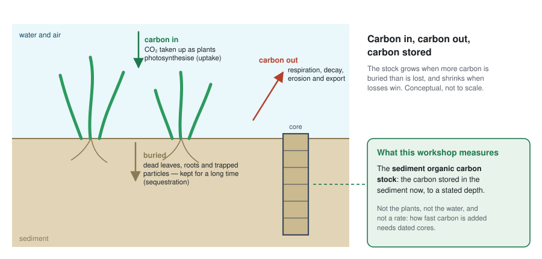

**Blue carbon** is the organic carbon captured and stored by coastal and marine
ecosystems. In Canada, this is primarily **seagrass/eelgrass meadows and tidal salt
marshes**. Syntheses of published measurements suggest these habitats can bury organic carbon in
their sediments faster, per unit area, than forest soils accumulate it (Mcleod et al. 2011) — though
burial rates vary widely from meadow to meadow, and a *rate* of burial is not the same as how much is
stored. Because the buried carbon is locked away in waterlogged, low-oxygen sediment, it can remain
there for centuries to millennia.

Three words come up again and again, and they mean different things:

1. **Uptake** — living plants pulling CO₂ out of the water and atmosphere as they photosynthesise.
   Much of that carbon goes back quickly as the plants respire, die and decay.
2. **Sequestration** — the part that is kept out of the atmosphere for a long time. In an eelgrass
   meadow, that mostly means organic carbon buried in the sediment. It is a *rate*: how much is added
   per year.
3. **Storage** (a **stock**) — the carbon held in the ecosystem now. The bulk of it sits in the
   *sediment* beneath the meadow, not in the plants themselves. This workshop measures that sediment
   stock, which is why our sampling focuses on sediment cores rather than biomass alone.

<table>
<tr>
<td width="60%">

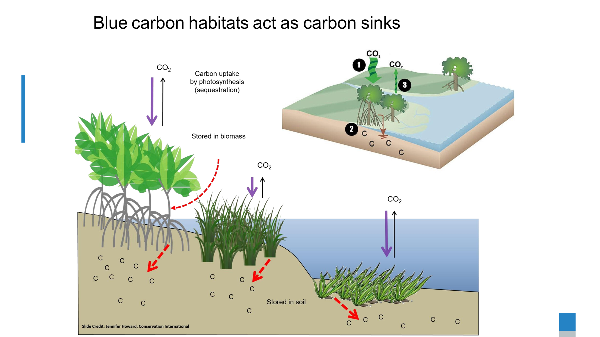

</td>
<td width="40%">

The plants, the soil, the water, and the air in this diagram represent the carbon
**pools** ("stocks"), the places that hold carbon at any point in time and can be
directly measured. The arrows represent the **processes** ("fluxes") that move carbon
between the pools. Over time, the fluxes in and out decide whether a pool grows or
shrinks — and so how much carbon is sequestered.

</td>
</tr>
</table>

> 🎥 **Watch:** [*Carbon stocks in sediment cores*](https://www.youtube.com/watch?v=2qAVE35UbiI&list=PLLsjpJMfNDP5w78ZJNDUvMj1VoRG_qSwd&index=1) — workshop playlist

---

## Eelgrass (*Zostera marina*)

Eelgrass is the dominant temperate seagrass across the North Atlantic. As a foundation
species it stabilises sediment, slows water flow (which encourages more particles to
settle and be buried), and supports fisheries and biodiversity, while continuously
adding organic carbon to the seabed.

<table>
<tr>
<td width="60%">

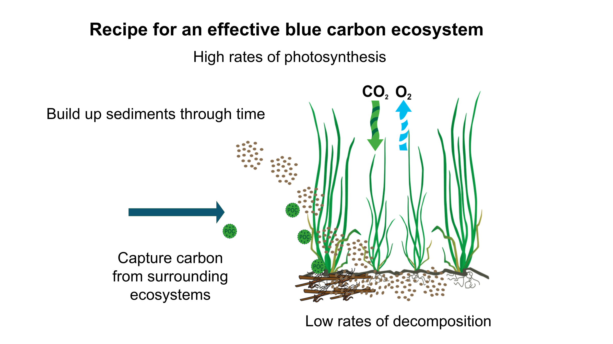

</td>
<td width="40%">

Eelgrass ecosystems can accumulate carbon derived from two places:

  1. "Autochthonous" carbon describes the accumulation of plant material growing within the ecosystem, deposited over time.
     
  2. "Allochthonous" carbon describes the accumulation of sediment and plant material transported into the ecosystem from surrounding environments.

</td>
</tr>
</table>

<table>
<tr>
<td width="60%">

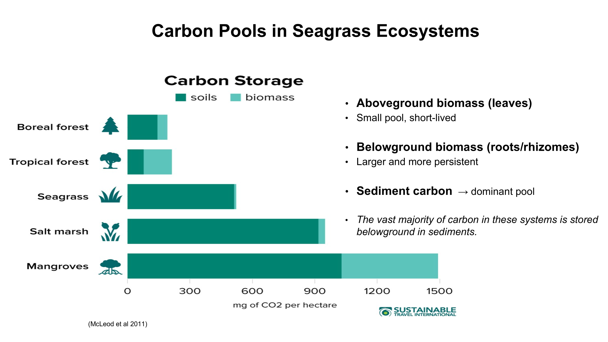

</td>
<td width="40%">

Eelgrass sediments typically hold lower organic carbon concentrations than other coastal
ecosystems, such as salt marshes. The chart shows global averages (McLeod et al. 2011), in
megagrams (Mg, not mg) of CO₂ per hectare. Local meadows can sit far below them: published BC
eelgrass cores average about 20 Mg C ha⁻¹ in the top 30 cm of sediment (Janousek et al. 2025).
Comparisons with forests, or with other meadows, only mean something when they cover the same area,
the same depth and the same carbon pool.

</td>
</tr>
</table>

---

## Carbon accumulation and equilibrium

<table>
<tr>
<td width="60%">

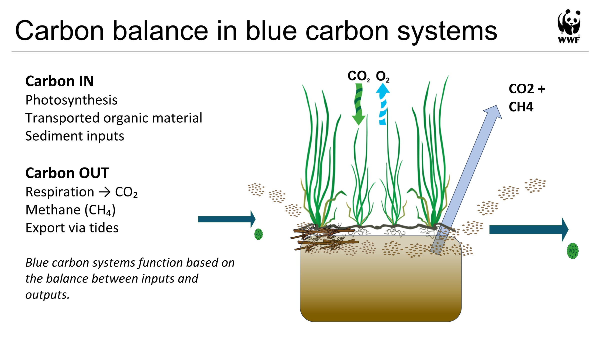

</td>
<td width="40%">

The balance of these carbon accumulating processes is countered by the decomposition of organic material
via soil microbial processes, and the transport of material out of the ecosystem by
tidal processes. The more sediment that accumulates, the more loss occurs over time, until
the ecosystem reaches a balance, referred to as the ecosystem's "carbon equilibrium
state", or simply "net ecosystem carbon balance"

</td>
</tr>
</table>

<table>
<tr>
<td width="60%">

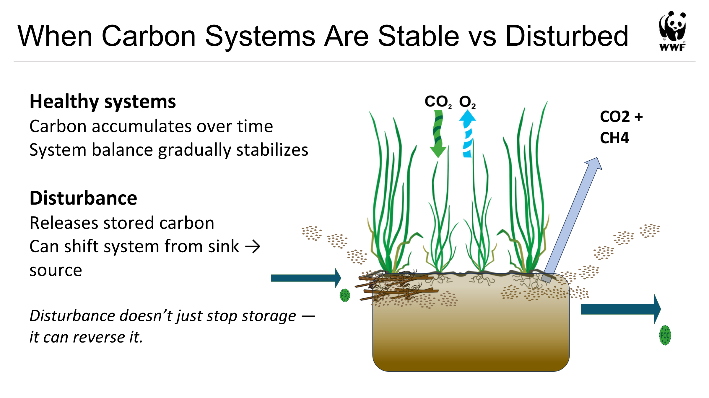

</td>
<td width="40%">

Healthy ecosystems accumulate carbon over time and respond resiliently to
environmental and human-caused disturbances.

</td>
</tr>
</table>

We can visualize this with a graph: carbon entering the ecosystem (green), carbon leaving it
(red), and the carbon stored, the result of the two (black). These curves are **conceptual** — drawn
with the [Ecosystem Carbon Accumulation Visualizer](https://cathald.github.io/CarbonAccumulationVisualizer/),
not measured at Cowichan, Tsawwassen or any other site.

<table>
<tr>
<td width="60%">

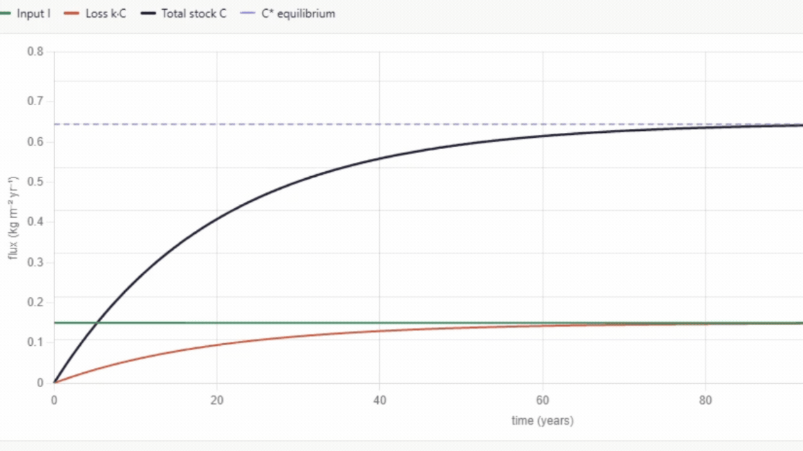

▶ <a href="images/carbon_accumulation_equilibrium.gif">Watch the animation</a>

</td>
<td width="40%">

Here is an ecosystem carbon curve, showing the baseline accumulation of carbon over
time. As carbon coming in and carbon going out converge, the amount of carbon
stored in the ecosystem levels off at a "peak," or equilibrium (represented by the dashed line).

</td>
</tr>
</table>

<table>
<tr>
<td width="60%">

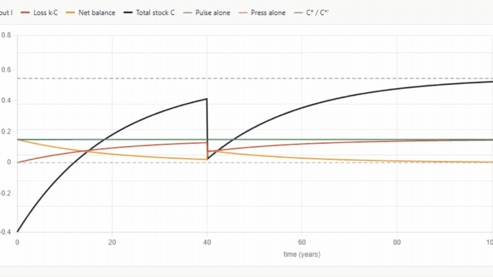

▶ <a href="images/carbon_disturbance_and_recovery.gif">Watch the animation</a>

</td>
<td width="40%">

And here is the same ecosystem, but with a single disturbance at year 40: the stored
carbon drops sharply, then recovers towards the same equilibrium.

</td>
</tr>
</table>

However, if/when multiple overlapping disturbances occur, the ecosystem can continue to
degrade over time, becoming a net emitter of carbon and losing the carbon it had stored. This is common in ecosystems experiencing "multiple stressors", "cumulative effects", and/or "altered disturbance regimes"

<table>
<tr>
<td width="60%">

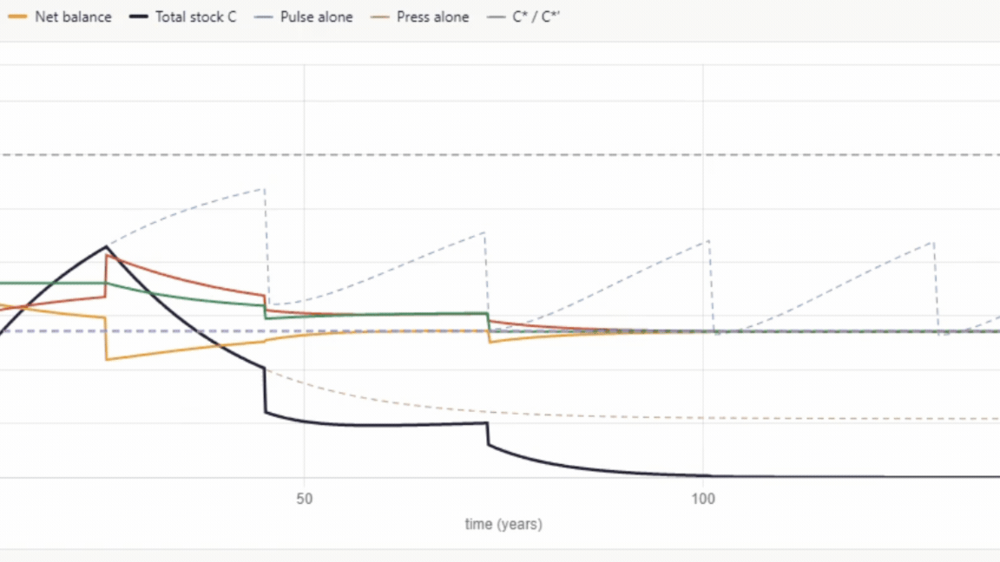

▶ <a href="images/carbon_pulse_press_collapse.gif">Watch the animation</a>

</td>
<td width="40%">

Here we see **"pulse"** disturbances, such as severe storms or land clearing, which disturb the
ecosystem abruptly, paired with **"press"** disturbances, which act slowly over long periods,
such as warming temperatures or spreading invasive species. Acting together, they can collapse the
ecosystem.

</td>
</tr>
</table>

## Interactive: Ecosystem Carbon Accumulation Visualizer

Explore how carbon accumulates in coastal ecosystems over time with the interactive
tool built for this workshop:

**👉 [cathald.github.io/CarbonAccumulationVisualizer](https://cathald.github.io/CarbonAccumulationVisualizer/)**

---
## What is sediment anyway?

Over time, as particles are transported into an ecosystem, or as plants growing within
it contribute organic matter (recall the allochthonous vs. autochthonous distinction),
these materials settle and build up, forming sediment.

<table>
<tr>
<td width="60%">

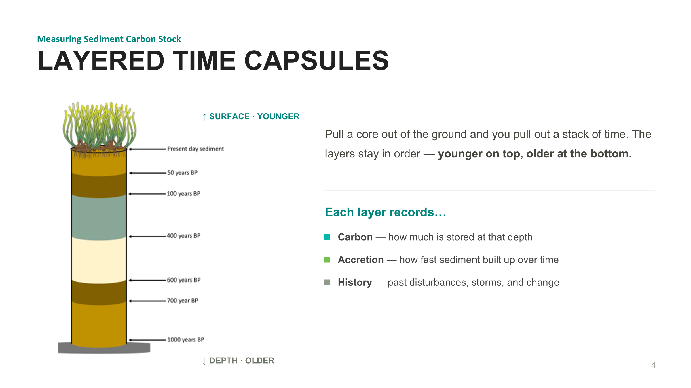

</td>
<td width="40%">

Taking a section of the sediment reveals the layers of accumulation over time.

</td>
</tr>
</table>

---
## So how do you measure sediment carbon?

<table>
<tr>
<td width="100%">

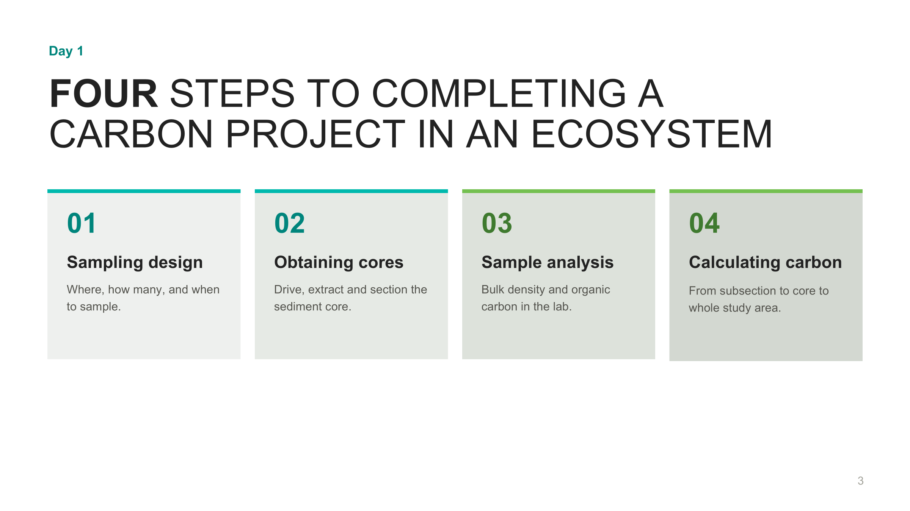

</td>
</tr>
</table>

Measuring carbon requires collecting a **sediment core**, determining how much
sediment is there (from its **volume** and dry **weight**), and measuring how much of that
sediment is carbon (its **organic carbon concentration**).

However, as simple as this sounds, aligning the actual measurements with the project's
larger goals ensures the samples you collect are used as effectively as possible. To
do this, there are 4 basic steps:

1. Apply a **sampling design**
2. Obtain **sediment core samples**
3. **Analyse** the samples
4. **Calculate carbon** and **interpret** the results

Most projects start from one of two questions. Some teams want to understand their own samples:
*what do our cores tell us, and how do they compare with other eelgrass meadows?* Others want a
number for a place: *how much carbon is stored in the sediment of this meadow or study area?* The
field and lab work is the same for both. The second question asks more of the planning — a defined
boundary, and cores placed so that together they represent the whole area — which is why the
question comes first.

The first two steps are the workshop's two core jobs (see the [main guide](../README.md)):

- **Making the data useful** (step 1) — *before* collecting anything, design the sampling so
  the data you'll gather aligns with the answers to your team's questions. That's
  [Section 2 — Project Planning](../02_Project_Planning/).
- **Collecting the data** (step 2) — Taking sediment cores and recording information required to obtain the data,
  That's [Section 3 — Field Methods](../03_Field_Methods/).

Steps 3 and 4 — analysing the samples and calculating carbon — are
[Section 4 — Data Interpretation](../04_Data_Interpretation/). Done together, they ensure the
samples you collect are used as effectively as possible to support your project and
organizational goals.

---

## Sources quoted in this section

- Mcleod, E. et al. (2011). A blueprint for blue carbon: toward an improved understanding of the role
  of vegetated coastal habitats in sequestering CO₂. *Frontiers in Ecology and the Environment* 9(10):
  552–560.
- Janousek, C.N. et al. (2025). Blue carbon stocks along the Pacific coast of North America are mainly
  driven by local rather than regional factors. *Global Biogeochemical Cycles* 39, e2024GB008239.

---

## In the next section

We'll start with **Project Planning**, here we will work on building a sampling plan, determining how
many samples to take and where to take them, in a way that best aligns with team,
organization, and community goals.

