<p align="center">
  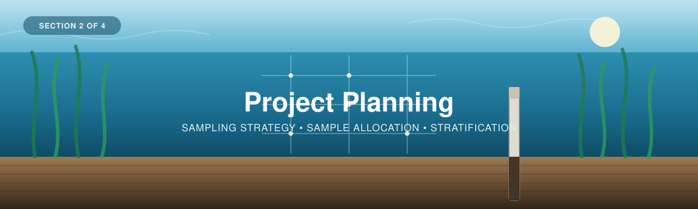
</p>

---

[← 1 — Background](../01_Background/) · [Back to main guide](../README.md) · Next: [3 — Field Methods →](../03_Field_Methods/)

---

# Part 2 — Project Planning
## From a carbon question to a sampling design

**Quick links:** [Sampling Design Guide](Sampling-Design-Eng-2026.pdf) · [Sample Allocation Calculator](BlueCarbon_SampleAllocation_Spreadsheet_V2.xlsx) · [Calculator — Google Sheets copy](https://docs.google.com/spreadsheets/d/1TGLz11ZmWO2EsAF86PMbEYZFO75_X_pKdJPS38a0O-M/edit?usp=sharing) · [Blue Carbon Hub tool](https://blue-carbon-hub.projects.earthengine.app/) · [Coastal Blue Carbon Field Guide](../Coastal-Blue-Carbon-Field-Guide-FINAL.pdf) · [Appendix A — sampling logic](#appendix-a--a-brief-lesson-in-sampling-logic)

---

**Before collecting sediment cores**, four questions are worth addressing:

1. **What do I want to know?** Am I interested in collecting baseline data? Making a comparison between different management types? Tracking restoration success? All of the above?
2. **Where does that question apply?** The whole ecosystem, just the eelgrass, high meadow vs low?
3. **How much data do I need?** How many samples is enough? What is our capacity to meet this?
4. **Where should the samples be collected from?**

Answering these is what a **sampling design** aims to achieve. It turns a carbon question into a field plan: a number of cores, and a set of sampling coordinates.

This section covers the five steps of a sampling design.

| # | Step | Answers |
|---|------|---------|
| 1 | **Define the study area** | *Where, roughly, am I working?* |
| 2 | **Stratify** (optional) | *Does the site split into distinct areas?* |
| 3 | **Choose the carbon pool** | *Water, plant, or sediment?* |
| 4 | **Determine how many samples** | *How many cores meet my goal?* |
| 5 | **Determine where they go** | *Exactly where do I core?* |

> The methods here follow WWF-Canada's [Sampling Design guide](Sampling-Design-Eng-2026.pdf) and the sampling guidance in the [Howard et al. Blue Carbon Manual](https://www.thebluecarboninitiative.org/manual) (see [Section 1](../01_Background/)).

**Two companion tools** appear throughout:

<table>
<tr>
<td width="50%">

**🗺 [Blue Carbon Hub sampling-design app](https://blue-carbon-hub.projects.earthengine.app/view/blue-carbon-sampling-plan-tool)**  A spatial tool; draw your boundary, stratify it, place your samples on a map.

*Used in Steps 1, 2 and 5.*

</td>
<td width="50%">

**📄 [Sample Allocation Calculator](BlueCarbon_SampleAllocation_Spreadsheet_V2.xlsx)** A simple spreadsheet for estimating sample size.

*Used in Step 4.*

</td>
</tr>
</table>

If you want to know how the calculator returns the number it does and dive deeper into the math behind the tools, look to [**Appendix A**](#appendix-a--a-brief-lesson-in-sampling-logic), at the bottom of this page, where we go through how sample size is estimated before sampling, and how to check whether the sampling met your goals afterwards.

---

## Background: What sampling is, and why it works

Measuring every square metre of an entire ecosystem isn't always feasible. So we measure a **small portion** of it and use that to estimate the whole. Because an estimate built from a portion will never be exactly right every single time, we also want to know how close it is likely to be. When the samples are chosen at random, with known chances of selection, the uncertainty can be put into numbers. This is called **probability-based sampling**.

<table>
<tr>
<td width="60%">

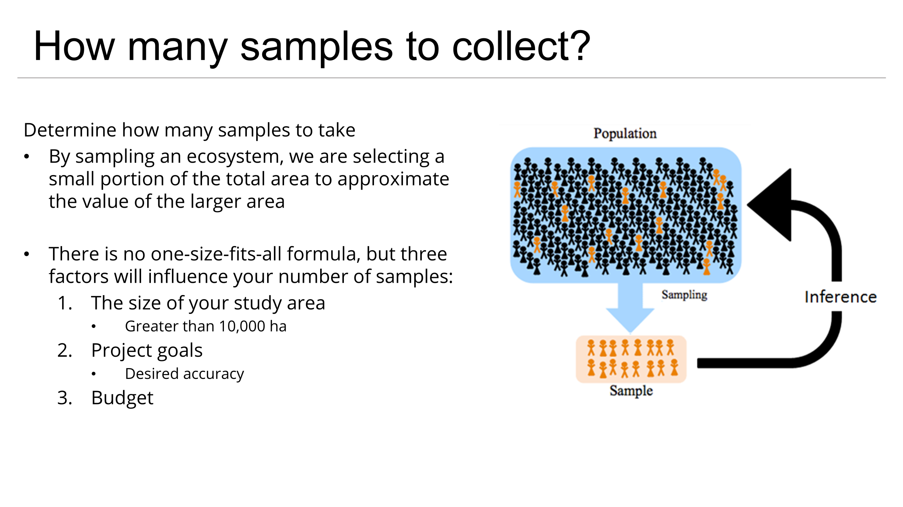

</td>
<td width="40%">

**Sampling** = taking a small portion of a thing to make an informed estimate of the whole.

A **sampling design** is the framework for choosing *what* and *where* to sample by dividing the study area into sites and plots, measuring those, and combining them into an estimate for the full area.

</td>
</tr>
</table>

The more samples you take, the closer your estimate is likely to be to the true value. Because you don't measure everything, every estimate carries uncertainty, which is why you will usually see a result reported in **three parts**:

| Component | | What it tells you |
|---|---|---|
| **Estimate** | $\bar{x}$ | The average carbon value across your sampled plots. |
| **Confidence level** | $1-\alpha$ | How often the method would capture the true value if the whole survey were repeated. At 95% confidence, about 95 out of every 100 intervals calculated this way would contain the true mean. It is a property of the method, not a 95% chance for any one interval. |
| **Margin of error** | $E$ | How precise that estimate is, or in words, the distance from the estimate to the edge of the interval, usually given relative to the mean (e.g. ±10%). |

> Put together: *"mean carbon = 100 ±10, at 95% confidence."*

### Seeing it on a map

These clips come from the **[Sample Size Visualization Tool](https://blue-carbon-hub.projects.earthengine.app/)**.

<table>
<tr>
<td width="60%">

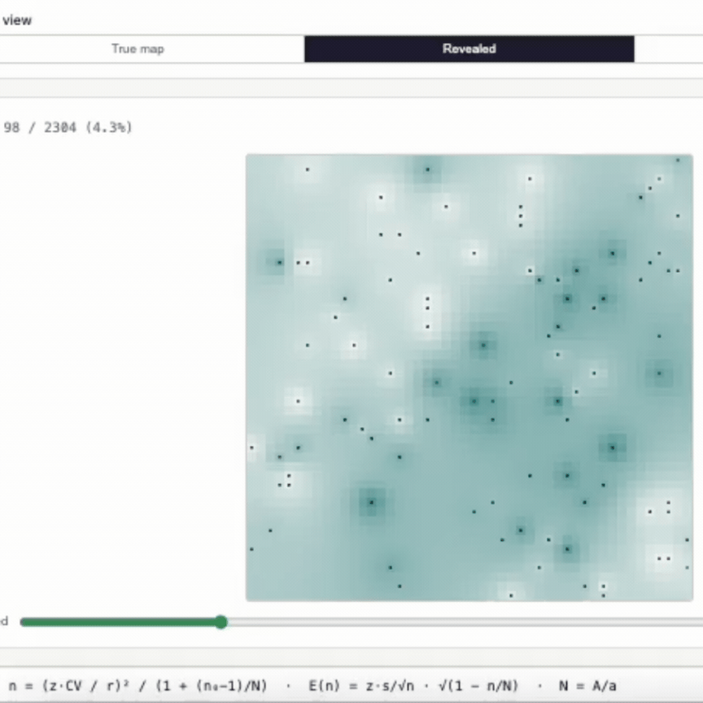

<sub>▶ <a href="images/sample_size_visualizer_revealed_map.gif">Watch the animation</a></sub>

</td>
<td width="40%">

The bottom-left map is a hypothetical carbon map, where each square is the carbon value at that location. Switch between the **True value** and the **Revealed** view to watch the map uncover itself one sample at a time.

</td>
</tr>
</table>

<table>
<tr>
<td width="60%">

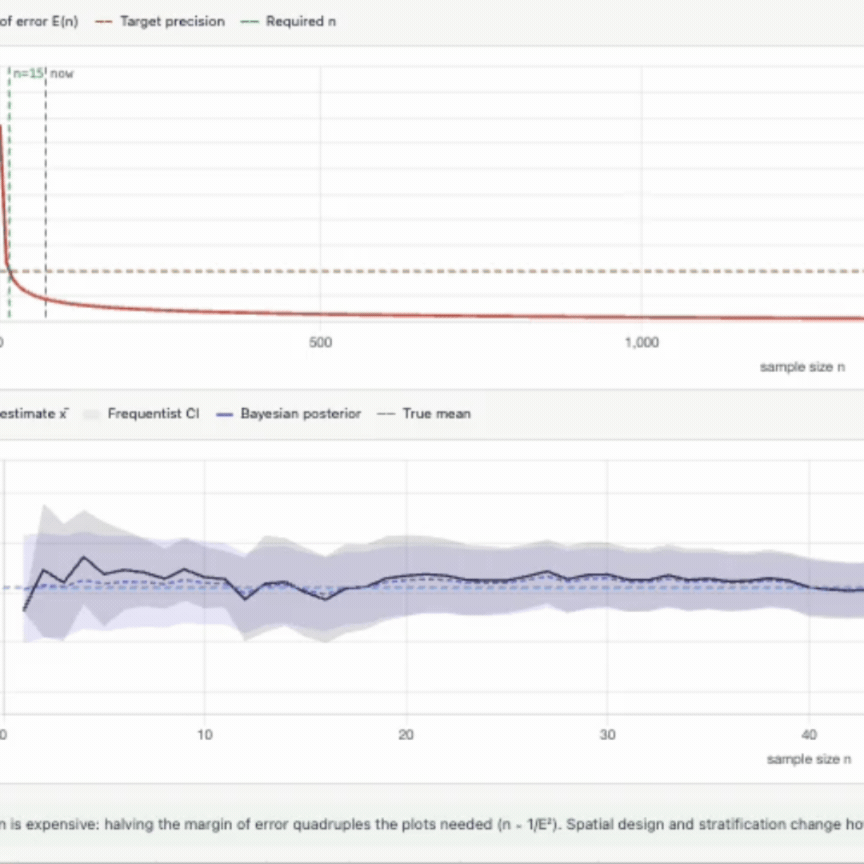

<sub>▶ <a href="images/sample_size_visualizer_estimate_converging.gif">Watch the animation</a></sub>

</td>
<td width="40%">

On the right, we see how each sample on the map is combined together to estimate the **true value** (dashed blue line). With a few samples the estimate is off and the error range (purple) is wide. As samples accumulate, it narrows.

**That purple band is your margin of error** — watch it shrink as the number of samples grows.

</td>
</tr>
</table>

### The takeaway

- Sampling estimates what's impractical to measure directly.
- The same process that produces an estimate can also tell you whether differences *within* or *between* sites are statistically significant.
- And it runs **backwards**: fix the precision you want, and it returns the number of cores needed to get there. That's Step 4, see [Appendix A2](#a2--working-backwards-from-precision-to-sample-size).

---

# Implementing a sampling design

<details>
<summary><b>📊 Meet the team at Tsawwassen Beach</b> &nbsp;·&nbsp; <i>the worked example, in brief</i></summary>

<br>

These drop-down menus contain brief descriptions from a hypothetical worked example. If you want to see how each of these steps can be applied, find them here or in the **→ [Worked Example](../Worked_Example/) folder**.

A team of four in B.C. is gathering **baseline carbon data in the Tsawwassen Beach eelgrass meadows**, before protection and restoration measures go in.

They want to gather information on two specific things:

**A)** the **average carbon stock** across the meadow, and

**B)** the ability to **compare** areas of the meadow against each other, and against future surveys.

Both need the same thing first: a sampling design. They appear at every step below.

**→ [Full planning walkthrough](../Worked_Example/02_Project_Planning.md)** · **→ [The whole project](../Worked_Example/)**

</details>

## Before Step 1 — Your question sets the decisions

*Which analysis will answer my question, and what does it need from the field?*

The workshop supports two questions, and they share the same field and lab work. They differ in
what has to be decided now:

| Decision | **A — What do our samples tell us, and how do they compare?** | **B — What do our measurements imply for this meadow or area?** |
|---|---|---|
| What is estimated | Each core's sediment organic-carbon stock, to a stated depth | The area's mean stock (Mg C ha⁻¹) and total (Mg C), to a stated depth |
| Study boundary | Optional — where the cores are | **Required** (Step 1). The estimate covers only what is inside it |
| Habitat or strata | The habitat each core represents | Strata and their areas, if you stratify (Step 2). A stratum with no cores is left out of the total |
| Reporting depth | A standard depth every core reaches: 0–15, 0–30, 0–50 or 0–100 cm | The same. Below the base of a core, carbon is estimated, and the deeper the reporting depth goes past your cores, the more of the answer is estimated |
| Sampling design | Any. A single core is fine — it describes one place | Random or stratified random placement (Step 5) gives an interval. Cores placed by judgement give an **exploratory** estimate with no interval |
| Precision target | Not needed | Needed for a random design, e.g. ±20% at 90% (Step 4) |
| Analysis (Part 4) | [Option A](../04_Data_Interpretation/#option-a--what-do-our-samples-tell-us-and-how-do-they-compare) | [Option B](../04_Data_Interpretation/#option-b--what-do-our-measurements-imply-for-this-meadow) |

**Why these come before fieldwork.** Each one changes where the cores go or how deep they must go,
and none can be fixed afterwards: a core that stops at 20 cm cannot measure 0–30 cm, and cores
placed by eye cannot support a confidence interval, however many there are.

**Plots, cores and slices.** The unit that counts is the **plot** — the patch of meadow a core
represents (10 × 10 m by default, see [Appendix A3](#a3--cochrans-correction-why-big-areas-stop-needing-more-cores)).
The slices cut from a core are measurements down that one core, not separate samples of the meadow.
Two cores taken in the same plot are one observation, and are averaged before any estimate. Sample
size, in Step 4, counts plots.

**Keeping monitoring possible.** This release does not analyse change over time, but a later
survey can only be compared with this one if you keep what it needs: stable plot and core IDs,
their coordinates, the survey dates, the same design and reporting depth, and the same field and lab
methods (including the LOI equation). Record them now — they cost nothing today and cannot be
recovered later.

## Step 1 — Define your study area

*Where, roughly, am I working?*

Every carbon value you produce from collecting cores is reported **per unit area**, so the boundary of the area in this step is what turns a carbon *density* into a carbon *total*. The sampling tool also reports how many 100 m² plots would fit inside it ($N$, the possible core positions). That matters only if you sample from that grid of plots, and for most meadows it barely changes the number of cores ([Appendix A3](#a3--cochrans-correction-why-big-areas-stop-needing-more-cores)).

<table>
<tr>
<td width="45%">

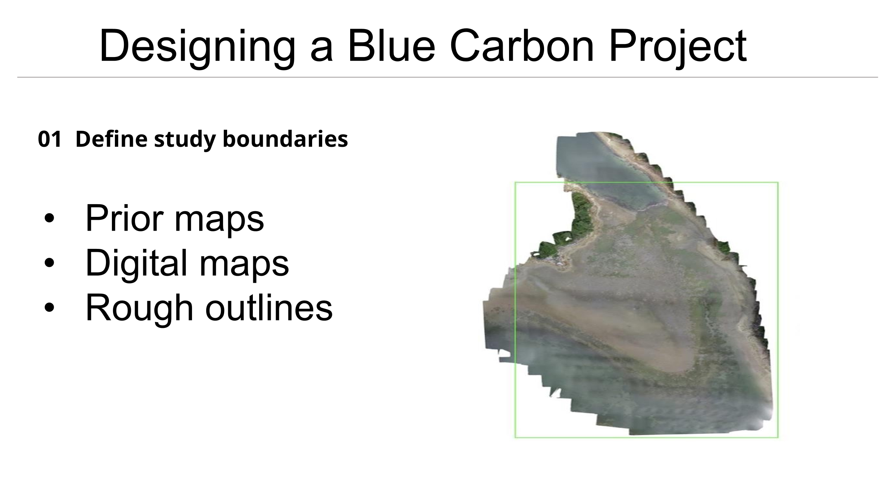

</td>
<td width="55%">

The boundary can be a simple polygon drawn on a map, or a pre-defined area if one already exists for your site.

If you run transects, or already know the general area you're interested in, a simple estimate of the area is enough.

</td>
</tr>
</table>

<details>
<summary><b>📊 Worked example</b> &nbsp;·&nbsp; <i>how the Tsawwassen team defined their area</i></summary>

<br>

They opened the sampling-design tool, chose **Draw it on the map**, and traced the eelgrass flats they could see on recent imagery. **Measure this site** returned **1,242.97 ha**, with room for 124,296 possible 100 m² core positions. They did not survey the edge.


**Saved output:** the boundary, exported from the tool, and its area — **1,242.97 ha**.

<details>
<summary><b>How good is a boundary traced from imagery?</b></summary>

<br>

Only as good as the imagery and the tide it was taken at. Edges blur, low-density eelgrass can be
invisible from above, and a different tide shows a different shoreline. Everything that uses the area
inherits that error — the stratum weights here and the total in Part 4 — and no confidence interval
includes it. Note how the boundary was drawn, and treat the area as approximate.

</details>

</details>

### 🛠 Your turn

<table>
<tr>
<td width="45%">

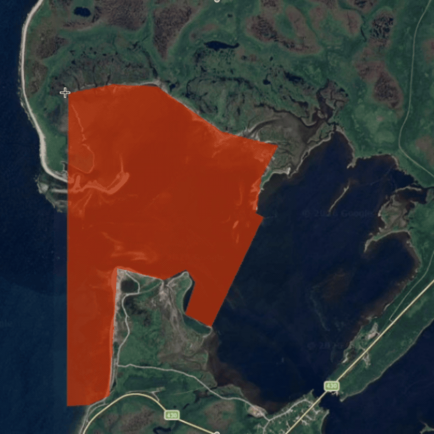

<sub>▶ <a href="images/boundary_drawing_demo.gif">Watch the animation</a></sub>

</td>
<td width="55%">

**Tool: [Blue Carbon Hub sampling-design app](https://blue-carbon-hub.projects.earthengine.app/view/blue-carbon-sampling-plan-tool)**

Draw a simple polygon over your area of interest — in the tool, in Google Earth Engine, or in whatever GIS you already use. Or import a pre-defined boundary if one exists.

Read the **area in m²** off the tool and write it down.

</td>
</tr>
</table>

> [!TIP]
> **✅ Before moving on, you should have:**
> - A boundary polygon (or a sketched area on a map)
> - Its **total area in m²** (Step 4 — Sample Allocation needs this number)

---

## Step 2 — Stratify your site *(optional)*

*Does the site split into distinct areas?*

When we measure carbon stock, we measure at a point and extrapolate this across a larger area, so the more that area resembles where we sampled, the more accurate the estimate will be. You wouldn't use a core from an eelgrass meadow to estimate carbon in an upland marsh, or vice versa. Splitting the two gives better numbers from the same effort.

<table>
<tr>
<td width="45%">

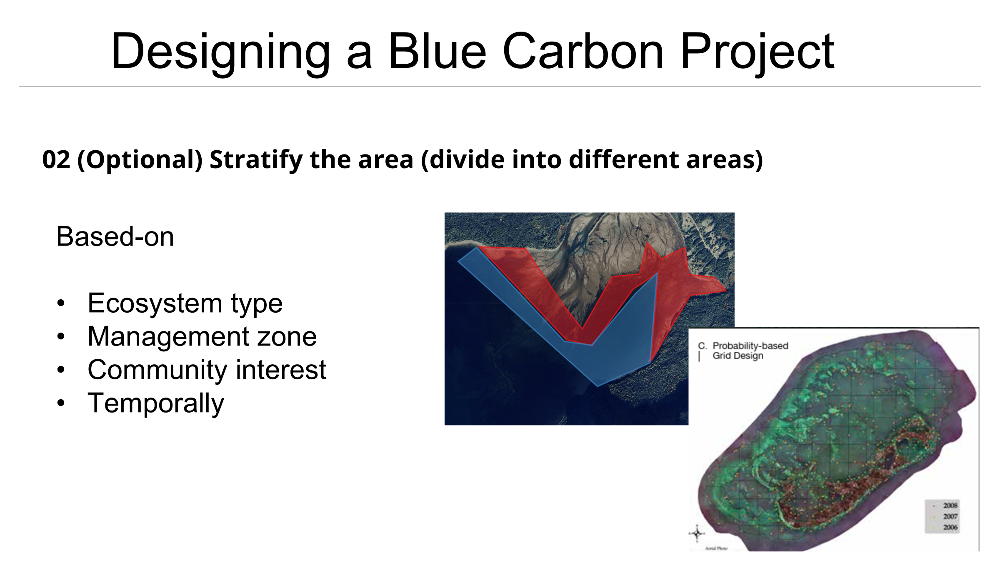

</td>
<td width="55%">

**Stratification** divides the study area into distinct sub-areas, so data collected in one is only applied within that one.

Beyond separating ecosystems, strata let you compare things deliberately: management techniques, restoration years, dense vs sparse meadow, depth zones.

Strata can be drawn by hand or derived from remote sensing.

</td>
</tr>
</table>

<details>
<summary><b>📊 Worked example</b> &nbsp;·&nbsp; <i>how the Tsawwassen team split their site</i></summary>

<br>

They ran the tool's automatic grouping (**Satellite Embeddings, 10 m**, three groups) and got three zones. Zone 1 traced the wetland edge around the flats rather than eelgrass, so they **unticked it**: it drops out of the design area. That left two eelgrass strata — **Zone 3, high-density eelgrass, 713.80 ha** and **Zone 2, low-density eelgrass, 361.95 ha** — together **1,075.75 ha**. Density was the most obvious driver of variation on the imagery, and their second question (B: comparing areas of the meadow) needed the split to exist before fieldwork, not after.


**Saved output:** two strata and their areas — high-density eelgrass 713.80 ha, low-density eelgrass 361.95 ha (Zone 1, 171.14 ha of wetland edge, excluded).

</details>

### 🛠 Your turn

<table>
<tr>
<td width="45%">

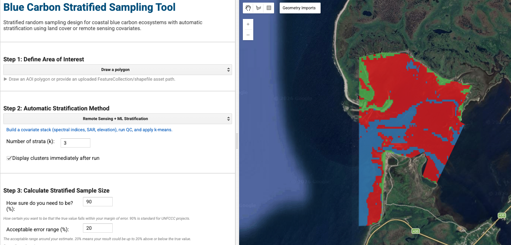

</td>
<td width="55%">

**Tool: [Blue Carbon Hub sampling-design app](https://blue-carbon-hub.projects.earthengine.app/)**

Take the boundary from Step 1 and either run the **automatic stratification**, or draw your strata by hand.

Record the **area of each stratum** — Step 4 uses these to divide the cores between them. Untick any zone you will not sample (deep water, bare flat, land): its area drops out of the estimate.

</td>
</tr>
</table>

> [!TIP]
> **✅ Before moving on, you should have** either:
> - **One** area containing a single ecosystem type, **or**
> - **Multiple** boundaries containing distinct ecosystems, management areas, or anything else you want to compare
>
> Plus the **area in m² of each**.

---

## Step 3 — Choose what to measure

*Water, plant, or sediment carbon?*

<table>
<tr>
<td width="45%">

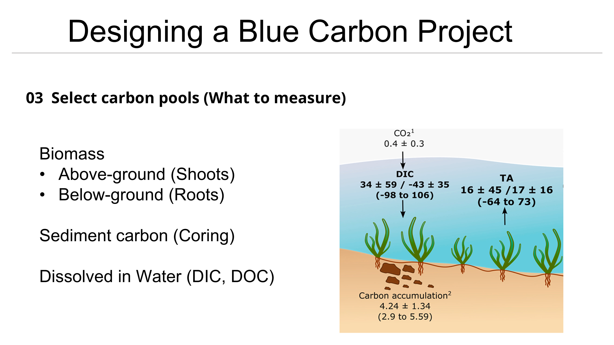

</td>
<td width="55%">

Carbon in a coastal ecosystem sits in several **pools**, such as the water column, the living plants, and the sediments.

For an eelgrass carbon project, the pool that matters most is the **sediment**. It holds the overwhelming majority of the carbon, and it's the pool that persists for a long time.

</td>
</tr>
</table>

<details>
<summary><b>📊 Worked example</b> &nbsp;·&nbsp; <i>what the Tsawwassen team chose</i></summary>

<br>

**Sediment organic carbon, reported to 30 cm** — the tool's *Top 30 cm* setting and the depth of their prior. That fixes a field rule: **every core must reach at least 30 cm** below the surface. They core to refusal where they can, so deeper cores are a bonus, and they note any core that stops short.

**Saved output:** carbon pool = sediment organic carbon; reporting depth = 0–30 cm; minimum core length = 30 cm.

</details>

### 🛠 Your turn

<table>
<tr>
<td width="45%">

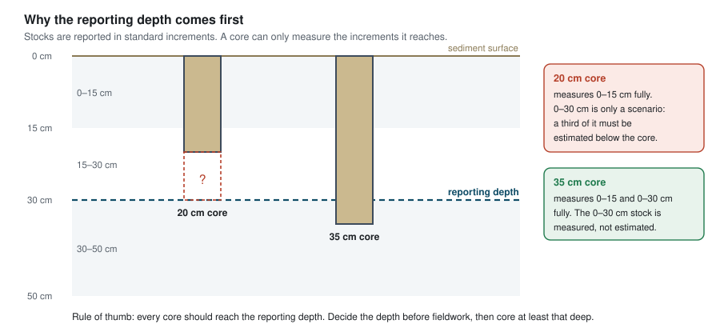

*Why the reporting depth comes first: a core that stops at 20 cm measures 0–15 cm completely, but not 0–30 cm.*

</td>
<td width="55%">

See [Section 3 — Field Methods](../03_Field_Methods/) for how to measure expected sediment depth with a metal rod

or watch this video

> 🎥 *[VIDEO — "Site Selection and Required Materials"]* · [workshop playlist](https://www.youtube.com/playlist?list=PLLsjpJMfNDP5w78ZJNDUvMj1VoRG_qSwd)

</td>
</tr>
</table>

> [!TIP]
> **✅ Before moving on, you should have:**
> - The **carbon pool** you're measuring, written down
> - A **reporting depth** (0–15, 0–30, 0–50 or 0–100 cm) — and so the minimum length every core must reach

---

## Step 4 — Decide how many samples

*How many cores meet my project goal?*

This is the step that sets how many samples are required to meet your goals. Too few cores and your estimate carries too much uncertainty to make confident decisions. Too many and you spend resources collecting data you didn't need, which could have gone towards other efforts.

To get there, you define three things, and the calculator returns an estimate of the number of samples.

| You provide | Meaning | Typical |
|---|---|---|
| **Area** (m²) | How big the boundary is, in square metres. Needed to split cores between strata; it barely changes the total | derived from Steps 1–2 |
| **Margin of error** ($E$) | How precise you need the estimate to be | ±10% or ±20% |
| **Confidence level** | How reliable that interval has to be | 80% or 90% |
| **A variability prior** *(optional)* | Roughly how much carbon is there, and how patchy | a pilot study, or regional values — see below |

### Where the prior comes from

The calculator needs a rough idea of how much carbon is there and how variable it is *before* you've measured anything. That's a **prior**, a rough estimate to start from.

Two sources, in order of preference:

| | Source | Use when |
|---|---|---|
| **1** | **A pilot study** — mean and standard deviation from a handful of your own cores, an earlier survey, or nearby sites | You can get a few cores before from a pilot study or from nearby locations. This is the better option: local variability is what actually drives sample size. |
| **2** | **Regional values** — published stocks from comparable ecosystems. By default we use the regional averages for coastal blue carbon ecosystems reported in Janousek et al. (2025) | You have no prior site data to go off. A regional value is a **planning scenario** borrowed from other meadows — not a measurement of how variable *your* meadow is. |

Because the CV is squared in the calculation, a modest change in the prior moves the number of cores a lot. Try two or three plausible values on the calculator's *5 Sensitivity* sheet, and if the budget allows, plan for the higher one.

> [!NOTE]
> The sample design tool uses open coastal blue carbon data for the Pacific Northwest from:
> Janousek, C. N., Krause, J. R., Drexler, J. Z., Buffington, K. J., Poppe, K. L., Peck, E., et al. (2025). Blue carbon stocks along the Pacific coast of North America are mainly driven by local rather than regional factors. *Global Biogeochemical Cycles*, 39, e2024GB008239. [doi:10.1029/2024GB008239](https://agupubs.onlinelibrary.wiley.com/doi/10.1029/2024GB008239)

<details>
<summary><b>📊 Worked example</b> &nbsp;·&nbsp; <i>what the Tsawwassen team calculated</i></summary>

<br>

<table>
<tr>
<td width="45%">


</td>
<td width="55%">

**Their inputs:**

- **Strata** (Step 2) — high-density eelgrass 713.80 ha, low-density eelgrass 361.95 ha (1,075.75 ha in all)
- **Confidence level** — 90% ($z = 1.645$)
- **Margin of error** — ±20% ($E = 0.20$)
- **Prior mean and SD** — 24.8 ± 16.8 Mg C ha⁻¹ to 30 cm: the sampling tool's Pacific Northwest eelgrass average (175 cores, Janousek et al. 2025) → $CV = 0.68$. A planning scenario, not a measurement of this meadow.

**Result: 32 cores** for the whole area. Shared out by stratum area and rounded up in each stratum: **33 cores — 22 in the high-density zone, 11 in the low-density zone.** The spreadsheet and the spatial tool agree, given the same prior.

**Saved output:** 33 cores, and how they split between the strata.

</td>
</tr>
</table>

</details>

### 🛠 Your turn

You can use the **📄 [Sample Allocation Calculator](BlueCarbon_SampleAllocation_Spreadsheet_V2.xlsx)**, or stick with the spatial tool in the **🗺 [Blue Carbon Hub app library](https://blue-carbon-hub.projects.earthengine.app/view/blue-carbon-sampling-plan-tool)**.

<table>
<tr>
<td width="45%">

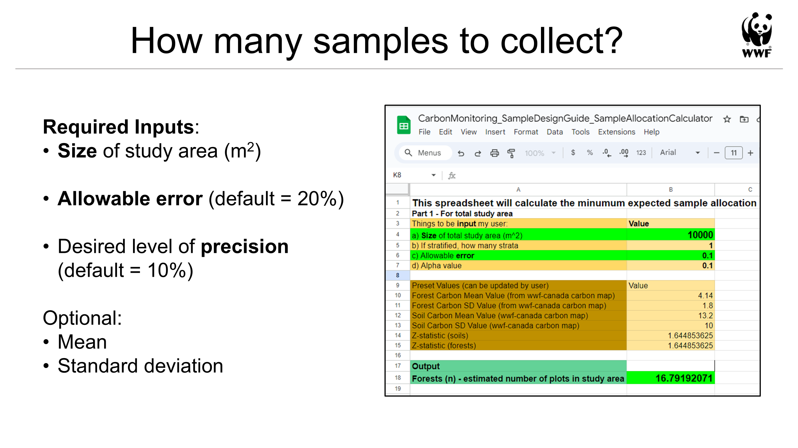

</td>
<td width="55%">

Enter an area, a margin of error, and a confidence level; the sheet returns the number of plots.

This is the **Sample Allocation Calculator** named in Step 3 of the [Sampling Design guide](Sampling-Design-Eng-2026.pdf) (p.16), which uses the central limit theorem to estimate the minimum number of plots needed to hit a target precision for a large area.

**Sheet 1** returns the total *n* for the whole study area. **Sheet 2** splits that *n* across the strata from Step 2, proportional to area — used in Step 5. **Sheet 3** holds the regional priors, **sheet 4** checks the precision you achieved after fieldwork ([Appendix A8](#a8--after-the-campaign-did-you-hit-your-target)), and **sheet 5** shows how *n* responds to the CV and the margin of error ([Appendix A4](#a4--what-actually-drives-sample-size)). A separate [Tsawwassen copy](BlueCarbon_SampleAllocation_Spreadsheet_V2_Tsawwassen_Example.xlsx) has the worked example's inputs entered. On each sheet, *Plots are the sampling frame?* stays **No** unless your cores are drawn from a fixed list of plots ([Appendix A3](#a3--cochrans-correction-why-big-areas-stop-needing-more-cores)).

</td>
</tr>
</table>

**Given the same prior, the two tools agree.** For Tsawwassen both return **33**. They differ when the prior differs: the spatial tool's Pacific Northwest eelgrass average ($CV$ = 0.68) needs about 40% more cores than the BC-only value on the calculator's *3 Priors* sheet ($CV$ = 0.58; 23 cores). That is why the prior's source, and its depth, belong in your notes.

The quickest way to build intuition is to open the calculator — or the [Blue Carbon Hub visualizer](https://blue-carbon-hub.projects.earthengine.app/) — and change **one knob at a time**, watching *n* respond. [Appendix A4](#a4--what-actually-drives-sample-size) has the full comparison if you'd rather read it than run it.


> [!TIP]
> **✅ Before moving on, you should have:**
> - A **target margin of error** and **confidence level** you can justify
> - A **prior** for mean carbon and its variability, and a note of where it came from
> - A **required number of cores** from the calculator or the spatial tool
>
> After the field season, you'll come back and check whether you actually hit that precision target — see [Appendix A8](#a8--after-the-campaign-did-you-hit-your-target).

---

## Step 5 — Decide where the samples go

*Exactly where do I core?*

<table>
<tr>
<td width="45%">

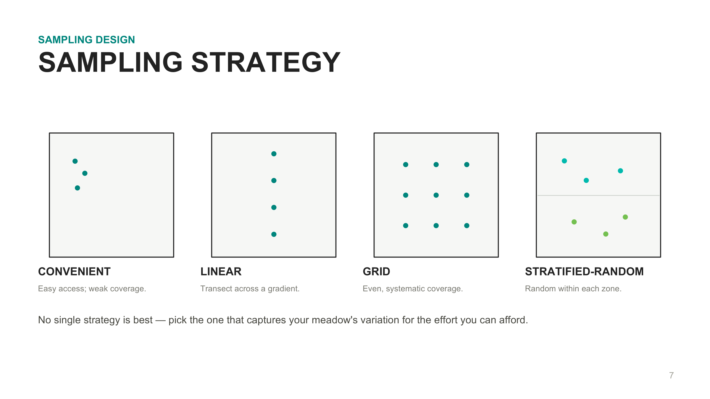

</td>
<td width="55%">

There are four common strategies for distributing samples. Which one fits depends on how much you already know about the site — and it decides what Part 4 can report.

</td>
</tr>
</table>

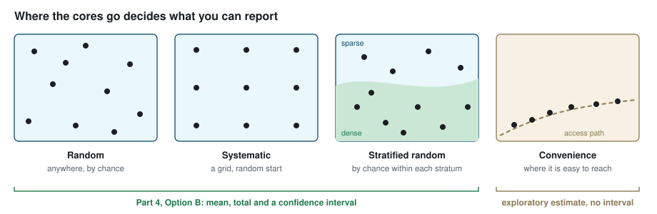

<details>
<summary><b>The four strategies in more detail</b></summary>

<br>

| Strategy | When to use it |
|---|---|
| **Random** | Plots placed randomly across the study area. Random is typically the default when the area is uniform or there's no prior data. |
| **Systematic** | Plots at regular intervals, from a random start. This method guarantees even coverage, but is most appropriate when you know the variation across the site is quite even. |
| **Stratified-random** | Strata first, then plots randomly assigned within each. This is the most accurate and cost-effective strategy. |
| **Convenience/practical** | Plots wherever is accessible. While not statistically rigorous, it is useful for a low-cost initial assessment — Part 4 reports it as an *exploratory* estimate, without a confidence interval. |

> See WWF-Canada, *[Measuring Carbon in Coastal Sediments](../Coastal-Blue-Carbon-Field-Guide-FINAL.pdf)* (2026), p.6.

</details>

### How does the total split across a boundary that has been stratified?

Each stratum gets a share of *n* **proportional to its area**, so a stratum covering half the meadow gets roughly half the cores.

More details of the allocation formula can be found in [Appendix A7](#a7--proportional-allocation-across-strata).

### For eelgrass specifically

<table>
<tr>
<td width="45%">

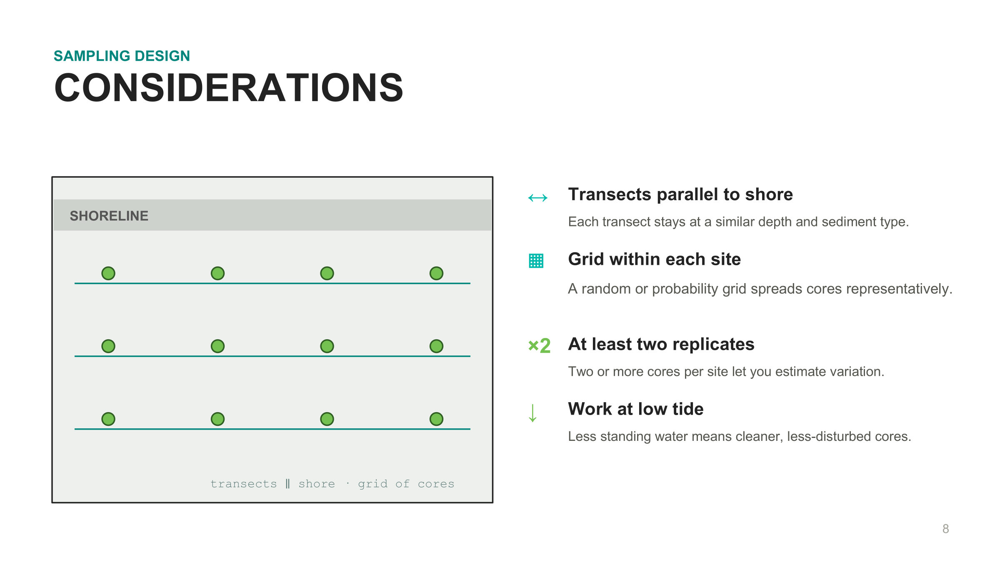

</td>
<td width="55%">

Eelgrass varies differently *parallel* to shore than *perpendicular* to it — depth, exposure and sediment all change as you move offshore.

The field guide therefore recommends transects that **run parallel to the shoreline**, aligned with sediment depth, with a random or probability-based grid within each site and at least two replicates per site.

</td>
</tr>
</table>

<details>
<summary><b>📊 Worked example</b> &nbsp;·&nbsp; <i>where the Tsawwassen cores went</i></summary>

<br>

Their **33** cores were allocated across the two strata **proportionally by area** — **22** in the high-density zone and **11** in the low-density zone — and the tool placed them **at random within each zone** (stratified random). No two cores share a 100 m² plot; the closest pair is 81 m apart. The locations were then downloaded as a CSV for the field team's GPS.


**Saved output:** the per-stratum allocation (22 + 11) and the exported coordinate list, plus the methods paragraph the tool writes for the report.

**→ [See how they got there](../Worked_Example/02_Project_Planning.md)**

</details>

### 🛠 Your turn

<table>
<tr>
<td width="45%">

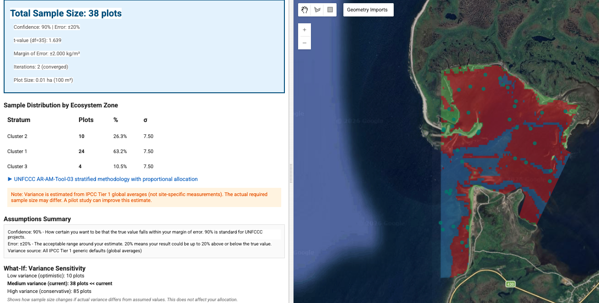

</td>
<td width="55%">

**Tool: [Blue Carbon Hub sampling-design app](https://blue-carbon-hub.projects.earthengine.app/)**

Feed it your strata from Step 2 and your *n* from Step 4. It allocates the cores between strata and generates sampling locations you can export and load onto a GPS.

**Source code:** [WWF-Canada-SKI/Carbon-Measurement — Sampling Design Tools](https://github.com/WWF-Canada-SKI/Carbon-Measurement/tree/main/Blue%20Carbon/Sampling%20Design%20Tools)

</td>
</tr>
</table>

> [!TIP]
> **✅ Before moving on, you should have:**
> - A **sampling strategy** chosen and justified
> - A **per-stratum core allocation**
> - A **coordinate list** of sampling locations, exported and loadable onto a GPS

---

## ✅ Sampling design complete

Before heading into the field, check you can answer all six:

```
  ☑  Study area boundary defined            → Step 1
  ☑  Strata identified (or ruled out)       → Step 2
  ☑  Carbon pool selected                   → Step 3
  ☑  Sample size calculated                 → Step 4
  ☑  Sampling locations generated           → Step 5
  ☑  Data sheets printed and ready          → Section 3
```

<details>
<summary><b>📊 The Tsawwassen plan at a glance</b></summary>

<br>

| Step | Their decision |
|---|---|
| 1 — Study area | **1,242.97 ha** traced from imagery |
| 2 — Stratify | **Two eelgrass strata** — high density 713.80 ha, low density 361.95 ha; the 171.14 ha wetland edge excluded |
| 3 — Carbon pool | **Sediment organic carbon to 30 cm**; every core at least 30 cm long |
| 4 — Sample size | **33** cores at ±20%, 90% confidence (prior CV 0.68) |
| 5 — Locations | Stratified random: 22 + 11 by stratum area, exported as a CSV |

**→ [Read the full planning walkthrough](../Worked_Example/02_Project_Planning.md)**

</details>

You now have everything a field team needs: a boundary, strata, a carbon pool and depth, a core count, and a list of coordinates. 

What remains is the fieldwork itself. **Section 3** covers what to bring, how to take a sediment core, how to record information on the data sheet, and the handling and labelling the samples.

**Next: [Section 3 — Field Methods →](../03_Field_Methods/)**

---
---

# Appendix A — A brief lesson in sampling logic

*and the derivations that drive this work*

Steps 1–5 don't require any of this. But if you want to know why the calculator behaves the way it does, or you need to defend a sample size to a reviewer, it's all here — in the order the ideas actually build on each other.

| | | Used in |
|---|---|---|
| [A1](#a1--what-an-estimate-actually-is) | What an estimate actually is | Background |
| [A2](#a2--working-backwards-from-precision-to-sample-size) | Working backwards: from precision to sample size | Step 4 |
| [A3](#a3--cochrans-correction-why-big-areas-stop-needing-more-cores) | Cochran's correction | Step 4 |
| [A4](#a4--what-actually-drives-sample-size) | What actually drives sample size | Step 4 |
| [A5](#a5--the-proportion-form) | The proportion form | Step 4 |
| [A6](#a6--symbol-crosswalk-to-the-unfccc-a64-tool) | Symbol crosswalk to the UNFCCC A6.4 tool | Step 4 |
| [A7](#a7--proportional-allocation-across-strata) | Proportional allocation across strata | Step 5 |
| [A8](#a8--after-the-campaign-did-you-hit-your-target) | After the campaign: did you hit your target? | Step 4 |

---

### A1 — What an estimate actually is

*The machinery behind the [Background](#background-what-sampling-is-and-why-it-works) section.*

You core a subset of plots and average them. That average, $\bar{x}$, is your estimate of the meadow's true mean carbon.

How far off might it be? That depends on two things: how much the plots differ from each other (the standard deviation, $s$) and how many you took ($n$). Combined, they give the **standard error of the mean**:

$$SE = \frac{s}{\sqrt{n}}$$

The $\sqrt{n}$ is the whole story of sampling economics. Four times the cores buys you *twice* the precision — never four times.

The **margin of error** scales that standard error by a multiplier set by your confidence level:

$$E \cdot \bar{x} = z\,\frac{s}{\sqrt{n}}$$

where $z = 1.282$ at 80% confidence, $1.645$ at 90%, and $1.96$ at 95%. Writing $E$ as a *relative* quantity (a fraction of the mean) is what lets you say "±20%" without knowing the answer in advance.

---

### A2 — Working backwards: from precision to sample size

*The machinery behind [Step 4](#step-4--decide-how-many-samples).*

Everything in A1 runs in reverse. If you know the precision you want, you can solve for the $n$ that delivers it.

Start from the margin-of-error definition and solve for $n$:

$$E \cdot \bar{x} = z\,\frac{s}{\sqrt{n}} \qquad \Longrightarrow \qquad n = \left(\frac{z \cdot s}{E \cdot \bar{x}}\right)^{2}$$

Then replace $s/\bar{x}$ with the **coefficient of variation**, $CV$:

$$n = \left(\frac{z \cdot CV}{E}\right)^{2}, \qquad CV = \frac{s}{\bar{x}}$$

Expressing variability as a $CV$ makes the result **scale-free** — it no longer depends on whether carbon is measured in Mg C ha⁻¹, g cm⁻³, or anything else. A meadow with $CV = 0.5$ needs the same number of cores whether it holds 40 or 400 Mg C ha⁻¹.

Notice what's squared: **$z$, $CV$ and $E$**. That single fact explains almost everything in A4.

This form treats the meadow as **continuous** — any point could be sampled — and it is the default in this workshop and in Part 4. [A3](#a3--cochrans-correction-why-big-areas-stop-needing-more-cores) covers the small adjustment for sampling from a fixed list of plots.

---

### A3 — Cochran's correction: why big areas stop needing more cores

*The machinery behind [Step 4](#step-4--decide-how-many-samples).*

**One modelling choice everything depends on:** each core is taken to represent a **plot, not a pinprick**. This workshop uses a **10 × 10 m plot (100 m²)** per core. Two cores 3 m apart claim the same plot, so they are one observation, not two — they are averaged before any estimate.

Suppose the possible plots are a **fixed list** — for example, the sampling tool's grid of 100 m² core positions — and you pick $n$ of them at random, never the same one twice. Then the population really is finite: a study area of $A$ m² holds $N = A \div a$ plots of $a$ m² each. Once you have sampled a large share of them, there is less left to be uncertain about. Cochran's **finite-population correction** gives you credit for that:

$$n \geq \frac{z^2\, N\, CV^2}{(N-1)\,E^2 + z^2\, CV^2}$$

**Use it only when the plots really are the sampling frame.** If cores go to random points in a continuous meadow, there is no fixed list to exhaust, and A2's form applies. In practice the choice rarely matters. The correction only bites when you sample a sizeable share of all plots: a 1 ha site holds 100 plots, and the correction trims 17 cores to 15. Tsawwassen's 33 cores, from about 107,500 possible positions, cover 0.03% of them, and the correction changes nothing.

As $N$ grows, $(N-1)E^2$ dominates the denominator and the correction fades — the formula converges on A2. That's why the effect of area **plateaus**.

---

### A4 — What actually drives sample size

*The machinery behind [Step 4](#step-4--decide-how-many-samples). If you read one appendix section, read this one.*

Four inputs dominate, and two of them sit **squared** in the formula.

All numbers below use a round-number baseline, typical of coastal MMRV work: **±20% margin of error**, **90% confidence**, $CV$ = 0.5 → **17 cores**, with the area treated as continuous (A2). The Tsawwassen prior, $CV$ = 0.68, gives 32. One knob turned at a time:

```
                                              cores needed (from 17)
  Precision      ±20% → ±10%     ████████████████████████  68
  Variability    CV 0.5 → 1.0    ████████████████████████  68
  Confidence     90% → 95%       ██████                    25
  Study area     5 ha → 500 ha   ████                      17
```

| Knob | Turn it… | Effect on *n* | Why |
|---|---|---|---|
| **Margin of error, $E$** | tighter: ±20% → ±10% | **4× more** (17 → 68) | $E$ is squared |
| **Variability, $CV$** | patchier: 0.5 → 1.0 | **4× more** (17 → 68) | also squared |
| **Confidence** | stricter: 90% → 95% | **about half as many again** (17 → 25) | $z$ is squared too, but 1.645 → 1.96 is a small step |
| **Study area** | bigger: 5 ha → 500 ha | **no change** (17 → 17) | see below |

Three things here routinely surprise people.

**CV is the hidden driver.** It's squared, exactly like $E$ — so a meadow twice as patchy needs **four times** the cores. This is why a good variability prior matters more than almost any other input, and why you pad the SD when you're unsure. It is also the one input you don't control: the meadow is as variable as it is.

**Precision is expensive; confidence is cheaper.** Tightening $E$ from ±20% to ±10% quadruples the fieldwork. Raising confidence from 90% to 95% costs about half as much again. **If the budget is fixed, loosening $E$ buys back far more cores than dropping confidence.**

**Area doesn't matter.** You're estimating a *mean*, and pinning down a mean depends on how variable the meadow is, not on how big it is. A meadow a hundred times larger needs the same number of cores. Only for a very small site sampled from a fixed list of plots does the correction in A3 trim a core or two. This is the single most counter-intuitive result in sampling design, and the one most worth being able to explain to a funder: **a bigger site is not a more expensive survey.**

---

### A5 — The proportion form

*The machinery behind [Step 4](#step-4--decide-how-many-samples), when the thing you're estimating isn't a mean.*

Everything above estimates a **continuous** variable — carbon stock. Some questions are instead about a **proportion**: what fraction of cores contain a peat horizon, what percentage of the meadow is still vegetated. Those use a parallel formula:

$$n \geq \frac{z^2\, N\, p\,q}{(N-1)\,E^2 p^2 + z^2\, p\, q}, \qquad q = 1-p$$

where $p$ is the expected proportion. **Use $p = 0.5$ when you have no prior** — it maximises $p\,q$ and therefore returns the largest, most conservative $n$.

---

### A6 — Symbol crosswalk to the UNFCCC A6.4 tool

*Useful if you're cross-referencing the [UNFCCC A6.4 Sampling & Surveys tool](Sampling-Design-Eng-2026.pdf) or its calculator.*

| This guide | UNFCCC tool | Meaning |
|---|---|---|
| $z$ | $Z_{\alpha/2}$ | z-multiplier set by confidence level |
| $E$ | $e_{abs}$ | target **relative** precision (0.20 = ±20% of the mean) |
| $s$ | $SD$ | expected standard deviation (your prior) |
| $\bar{x}$ | mean | expected mean (your prior) |
| $CV$ | $CV$ | coefficient of variation, $s/\bar{x}$ |
| $N$ | $N$ | population size: the number of plots in the sampling frame — see note |
| $n$ | $n$ | number of plots/cores to collect |

> **Where the two calculators differ — and it's only one thing.** The formula is identical. They differ in how $N$ is obtained: the WWF-Canada area-based calculator derives it from **total area ÷ plot size** (when you choose to treat the plots as the sampling frame), while the UNFCCC tool takes a **population count** directly. Because $(N-1)$ barely moves the result once $N$ is large, both converge on the same answer — which is exactly the plateau described in [A4](#a4--what-actually-drives-sample-size).

---

### A7 — Proportional allocation across strata

*The machinery behind [Step 5](#step-5--decide-where-the-samples-go).*

Each stratum receives a share of the total $n$ proportional to its area:

$$n_h = W_h \times n, \qquad W_h = \frac{A_h}{A}$$

where $A_h$ is the area of stratum $h$, $A$ is the total area of the strata you will sample, and $W_h$ is the stratum's **weight** — the same weight Part 4 uses to combine the stratum means. For Tsawwassen: $W$ = 713.80 ÷ 1,075.75 = 0.66 and 361.95 ÷ 1,075.75 = 0.34, so 32 cores become 21.2 → **22** and 10.8 → **11**.

Then two practical rules are applied on top: round each $n_h$ **up** to a whole core, and raise any stratum below **5 cores** to 5. Both push the total above $n$ — deliberately. Rounding down or allowing a 2-core stratum would leave you unable to estimate variance within that stratum at all.

---

### A8 — After the campaign: did you hit your target?

*The machinery behind the check you run once [Step 4](#step-4--decide-how-many-samples)'s cores come back.*

Sample-size planning uses *expected* variability. Real cores may be more or less variable than your prior assumed, so before trusting the estimate, check the **achieved** precision against the target you set.

Recompute precision from what you actually measured:

$$\text{RME} = \frac{t \cdot SE}{\bar{x}}, \qquad SE = \frac{s}{\sqrt{n}}$$

Here $s$ and $\bar{x}$ are the **sample** standard deviation and mean — measured, not assumed — and $t$ is the multiplier for your confidence level with $n-1$ degrees of freedom (with $H$ strata, $n-H$; the stratified $SE$ combines each stratum's $s_h^2/n_h$ with weights $W_h^2$). Use $t$, not $z$, once you have real data: with 10 cores at 90% confidence, $t$ = 1.83 against $z$ = 1.645. Only if the plots were drawn from a fixed list (A3) does the $SE$ gain the correction factor $\left(1-\tfrac{n}{N}\right)$.

Compare the **relative margin of error (RME)** to the target $E$ you set in Step 4:

- **RME ≤ E** → the estimate meets its reliability criterion. Report it.
- **RME > E** → the meadow was patchier than your prior assumed, or you had fewer usable cores than planned.

The calculator's *4 Precision Check* sheet does this for you, and Part 4's Option B report states it.

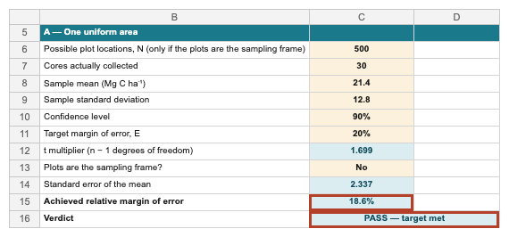

**If you miss the target:**

1. **Check the records** — transcription slips, units, a mislabelled core. Correct what was recorded wrongly. Never remove a value just because it widens the interval.
2. **Report the precision you achieved.** An estimate that missed its target is still the estimate. Say so plainly, with its interval.
3. **Plan the next survey with the CV you measured.** Step 4 then tells you how many more cores would close the gap.

Two shortcuts make a result look more certain than it is, so avoid them. One is drawing new strata after seeing the carbon values: post-stratification is only sound when the strata and their areas are defined independently of the results, ideally before fieldwork. The other is quoting only the lower end of the interval as "the" estimate.

This comparison — not the planned sample size — is what you report and what a reviewer will check.

---

## In this section

- [`BlueCarbon_SampleAllocation_Spreadsheet_V2.xlsx`](BlueCarbon_SampleAllocation_Spreadsheet_V2.xlsx) — the sample-size and allocation calculator
- [`Sampling-Design-Eng-2026.pdf`](Sampling-Design-Eng-2026.pdf) — the WWF-Canada sampling-design guide
- `images/` — screenshots of the calculator and planning materials

<details>
<summary><b>📋 Slide/screenshot layout template — copy/paste this to add an image</b></summary>

Each image is a two-column block: the image on the left and a description on the right.
To add one, copy the block below and:

1. In GitHub's editor, click inside the left cell (between the blank lines) and **paste or drag your image** — or paste the image URL into `src="…"`.
2. Type your description in the right cell (plain text, **markdown**, links, and lists all work).

Keep the blank lines inside the cells — they're what let GitHub render the pasted image and formatted text.

```html
<table>
<tr>
<td width="45%">


</td>
<td width="55%">

Paste your description here.

</td>
</tr>
</table>
```

</details>

---

[← 1 — Background](../01_Background/) · [Back to main guide](../README.md) · Next: [3 — Field Methods →](../03_Field_Methods/)
