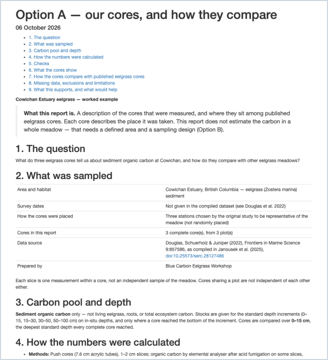
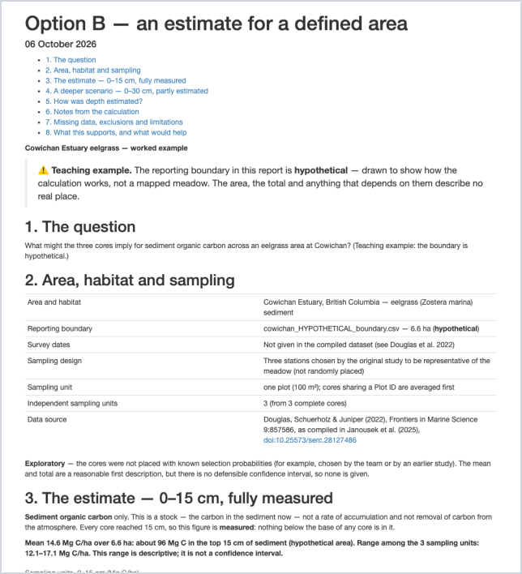
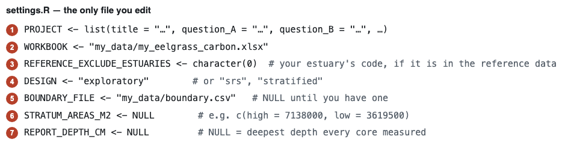

# Data analysis workflow — quick start

*Turns the completed digital data sheet into checked core stocks, a comparison with published
eelgrass cores (Option A), and an estimate for a defined area (Option B).*

[← Part 4 — Data Interpretation](../README.md) · [Back to main guide](../../README.md)

---

You do not need to write R. You edit one settings file and run one line. Everything else —
checks, tables, figures and a short report — is produced for you, from the same workbook you
filled in during [Part 4](../README.md).

## What you get

<table>
<tr>
<td width="50%">



**Option A report** — your cores, and how they compare.
[Open the example](example_reports/cowichan_report_option_A.html)

</td>
<td width="50%">



**Option B report** — an estimate for a defined area.
[Open the example](example_reports/cowichan_report_option_B.html)

</td>
</tr>
</table>

Every report states the question, area, carbon pool and depth, dates, design, number of independent
sampling units, method, the estimate and what its uncertainty includes, exclusions, and what the
result supports. The example reports are HTML files: download one and open it in any browser.

## The few lines you change



Everything else in `settings.R` has a sensible default. Each line is explained in the file itself.

## 1. Install (once)

1. Install **R** (4.1 or later) from [cran.r-project.org](https://cran.r-project.org) and
   **RStudio** from [posit.co](https://posit.co/download/rstudio-desktop/). RStudio includes
   pandoc, which the reports need.
2. In the RStudio console, install the packages:

   ```r
   install.packages(c("readxl", "ggplot2", "survey", "rmarkdown", "knitr"))
   ```

   `testthat` is only needed if you want to run the checks in `tests/`.

## 2. Point it at your workbook

Download or copy this `DataAnalysisWorkflow/` folder. Open it in RStudio and set it as the working
directory (*Session → Set Working Directory → To Source File Location* with `settings.R` open).

Open **`settings.R`** — the only file you need to edit. As shipped it runs the Cowichan worked
example. Replace the lines in the picture above.

<details>
<summary><b>Every section of settings.R</b></summary>

<br>

| Section | What to set |
|---|---|
| 1. Your project | The words that go into the report: title, questions, area, dates, design, methods, data source |
| 2. Your data | `WORKBOOK` — the path to your saved `.xlsx` |
| 3. Option A | Comparison depth (blank = the deepest standard depth all your cores reached), region, and your own estuary's code to leave out |
| 4. Option B | `DESIGN` (`"exploratory"`, `"srs"` or `"stratified"`), `BOUNDARY_FILE`, stratum areas, plot size, reporting depth and deeper scenario, precision target |

</details>

The boundary is a CSV of `longitude,latitude` vertices in decimal degrees — draw it in any GIS or
Google Earth and export the corners. See [`data/example_area/`](data/example_area/) for the format.

## 3. Run

```r
source("run_option_A.R")   # Option A: our cores, and how they compare
source("run_option_B.R")   # Option B: an estimate for a defined area
```

Both start by checking the workbook. Anything that keeps a core out of the totals is printed first.
That covers a missing lab value, a gap, a duplicate ID or unmeasured compaction. The same messages
appear in the workbook's *Slice check* and *QC check* columns. Fix those in the workbook, save it,
and run again.

## 4. Where the results go

| Folder | Contents |
|---|---|
| `outputs/option_A/` | `report_option_A.html`; checked slices; core and increment stocks; the comparison table and both reference sets; profile, increment, comparison, bulk-density and location figures |
| `outputs/option_B/` | `report_option_B.html`; each core's measured and estimated stock by increment; sampling-unit values; the area estimate at every standard depth; carbon curves and the reporting-area map |

Open the `.html` reports in any browser.

<details>
<summary><b>What the workflow does, and does not do</b></summary>

<br>

- **Shared foundation** (`R/01_read_and_check.R`, `R/02_core_stocks.R`): reads the workbook
  directly, repeats every workbook check, and cross-checks its numbers against the workbook's. It
  calculates slice stocks on the measured interval, places them on in-situ depths, and splits them
  into 0–15, 15–30, 30–50 and 50–100 cm by overlap. Carbon is conserved, and that is checked on
  every run.
- **Option A** (`R/03_option_A.R`): measured values only. Reference cores come from
  [`data/reference/`](data/reference/). Your estuary is excluded, and so is anything within 100 m
  of your cores.
- **Option B** (`R/04_option_B.R`): leads with the deepest standard depth every core **measured**.
  A deeper figure is added as a clearly labelled scenario only where the cores are long enough —
  following Janousek et al. (2025), 20 cm for 0–30 cm, 35 cm for 0–50 cm and 75 cm for 0–100 cm. Its
  estimated share is shown increment by increment. It averages cores within a plot, then estimates the
  area mean and total as the design allows: no interval for exploratory sampling, a t-interval for
  simple random sampling, and `survey` for stratified designs. The finite-population correction is
  used only when you set `PLOTS_ARE_SAMPLING_FRAME <- TRUE`, i.e. when the cores were drawn from a fixed
  list of plots.
- It does **not** make a prediction surface, combine your cores with a prior, or estimate change
  over time. The optional modules in [`going_further/`](going_further/) cover the first two, and
  are not used by Options A or B.

</details>

## Worked examples in this folder

| Run | Data | What it shows |
|---|---|---|
| `source("run_option_A.R")` | Three published Cowichan eelgrass cores (Douglas et al. 2022, via Janousek et al. 2025) | Option A on real measurements |
| `source("run_option_B.R")` | The same cores, inside a **hypothetical** 6.6 ha boundary, exploratory design | How Option B handles cores that stop at 20 cm, and why no interval is given |
| `SETTINGS_FILE <- "settings_synthetic.R"; source("run_option_B.R")` | A **synthetic** stratified survey, computer-generated, at 0° N 0° E | The stratified calculation, its interval, and an unsampled stratum |

<details>
<summary><b>Folder contents</b></summary>

<br>

| Path | What it is |
|---|---|
| `settings.R` | The one file you edit |
| `run_option_A.R`, `run_option_B.R` | The two run scripts |
| `report_option_A.Rmd`, `report_option_B.Rmd` | Report templates (filled in automatically) |
| `R/` | The functions, in workflow order |
| `data/reference/` | Published *Zostera marina* cores for Option A comparisons — see its README |
| `data/example_area/` | The worked example's hypothetical boundary |
| `data/synthetic/`, `settings_synthetic.R` | The synthetic stratified demonstration |
| `tests/testthat/` | Automated checks of the calculations, on synthetic fixtures: `testthat::test_dir("tests/testthat")` |
| `data-raw/` | Maintainer scripts that rebuild the workbooks and reference files. Participants never need these |
| `going_further/` | Optional modules that build on Options A and B |
| `advanced/` | The earlier research pipeline, kept for reference. Nothing here depends on it |
| `example_reports/` | The rendered example reports, kept so you can look before you run anything |

</details>
