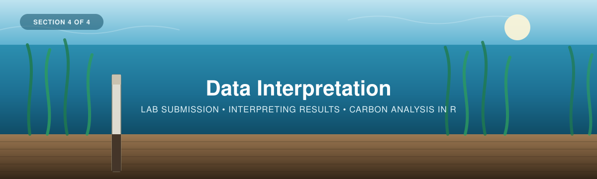
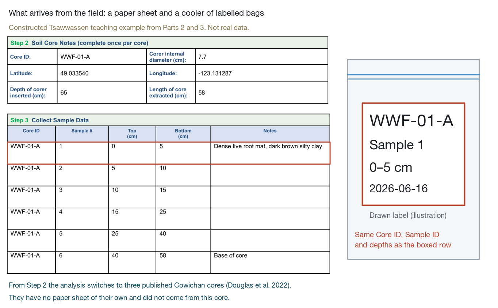
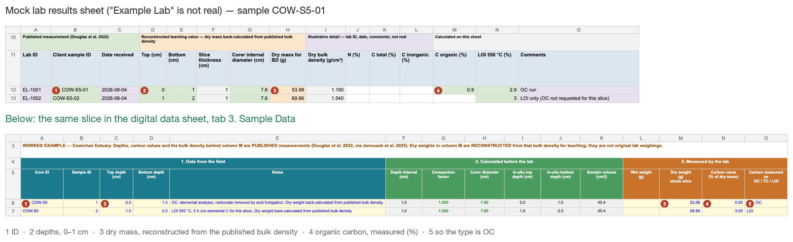
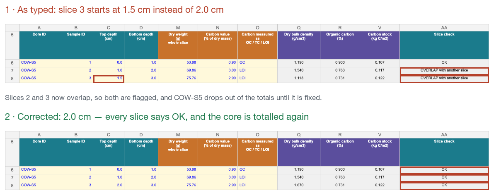
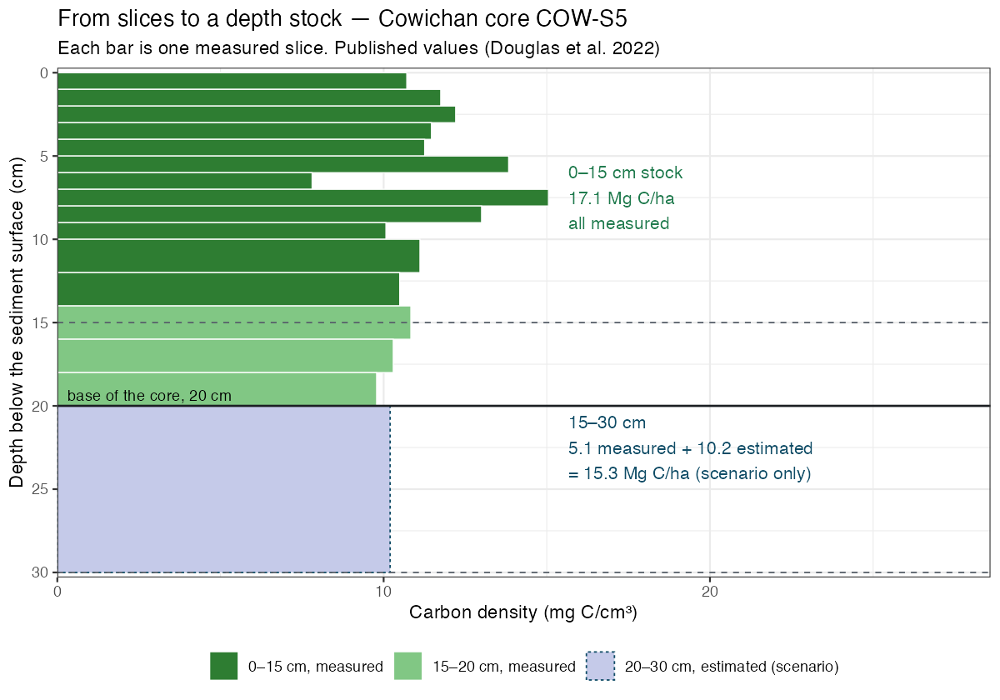
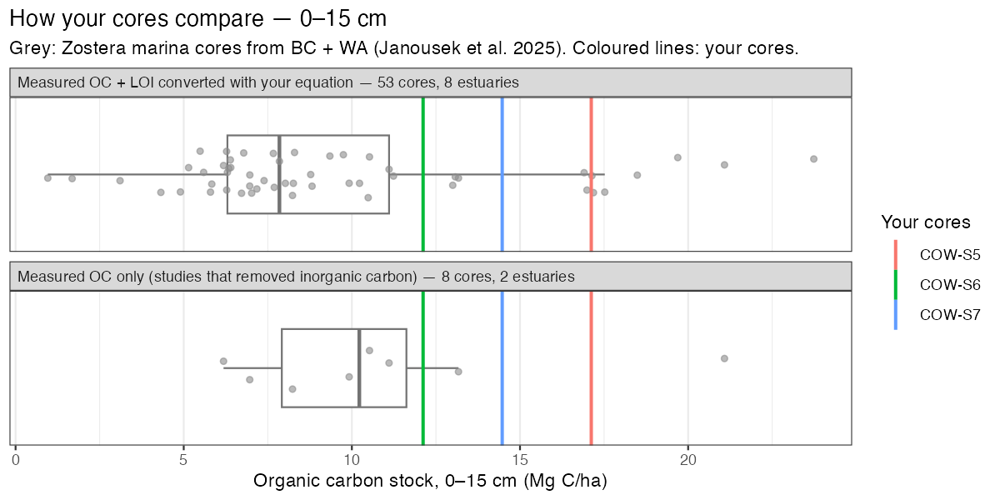
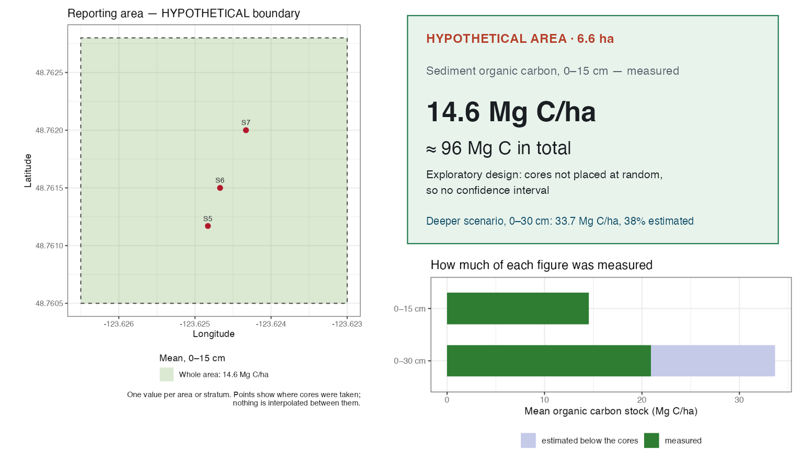
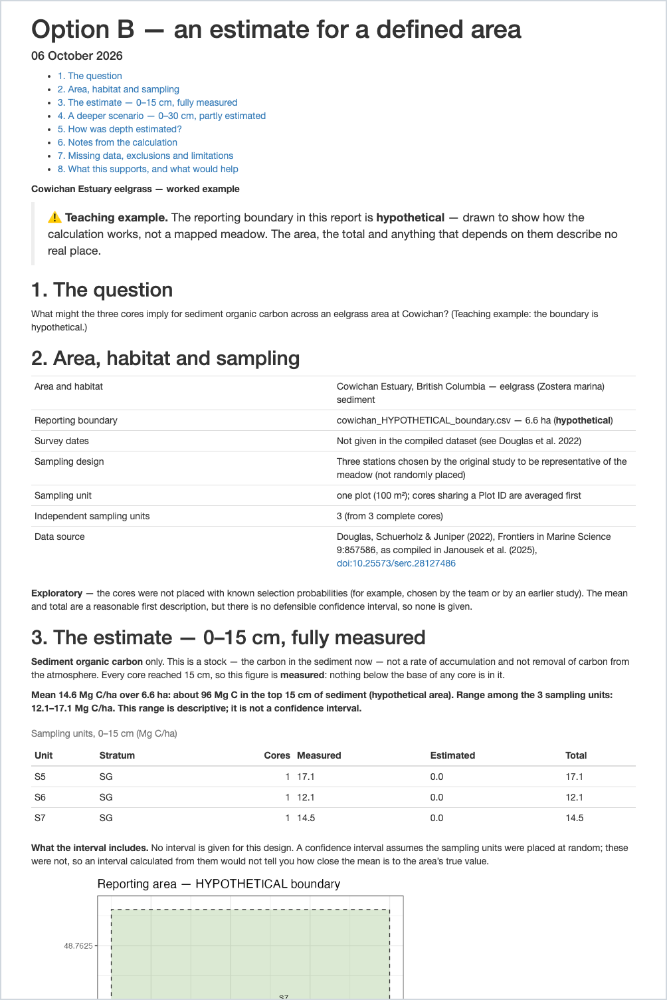

<p align="center">
  
</p>

---

# Part 4 — Data Interpretation

*From sediment samples to carbon-stock estimates.*

[← 3 — Field Methods](../03_Field_Methods/) · [Back to main guide](../README.md)

---

## Overview

This section covers what happens after the cores come out of the field: prepping your samples,
digitizing your field sheet, sending samples to a lab, checking what comes back, and turning it
into a carbon stock you can report.

It follows WWF-Canada's field guide (*Part 3: Sample Analysis* and *Part 4: Calculating Carbon
Stocks*, pp. 15–19 of the [Coastal Blue Carbon Field Guide](../Coastal-Blue-Carbon-Field-Guide-FINAL.pdf)),
with a dedicated [Lab Guide](Lab-Guide-Eng-2026.pdf) for the laboratory procedures, alongside
Howard et al. (2014).

Everyone follows the same four steps. They take you from bagged samples to checked core stocks
that can be compared with each other. Then the path splits, depending on the question you chose
in [Part 2](../02_Project_Planning/):

| # | Step | Answers |
|---|------|---------|
| 1 | **[From the field to the lab](#step-1--from-the-field-to-the-lab)** | *How do I prep samples, digitize my data, and find a lab?* |
| 2 | **[Enter the lab results](#step-2--enter-the-lab-results)** | *Where does each number from the lab go?* |
| 3 | **[Check the data](#step-3--check-the-data)** | *Is anything missing, mislabelled or inconsistent?* |
| 4 | **[Core stocks on a common footing](#step-4--core-stocks-on-a-common-footing)** | *How much carbon is in each core, to which depth?* |
| A | **[Option A — our cores, and how they compare](#option-a--what-do-our-samples-tell-us-and-how-do-they-compare)** | *What do our samples tell us, and how do they compare?* |
| B | **[Option B — an estimate for a defined area](#option-b--what-do-our-measurements-imply-for-this-meadow)** | *What do our measurements imply for this meadow or study area?* |
| 5 | **[Report the results](#step-5--reporting-the-results)** | *What do I report, and what does each number mean?* |

> 🧭 **Two examples, kept apart on purpose.** The field records at the start of this part — the
> paper sheet and the `WWF-01-A` tables — are the **constructed Tsawwassen** example from Parts 2
> and 3. From the lab results onwards the analysis **switches to three published eelgrass cores
> from the Cowichan Estuary, BC** (Douglas et al. 2022, via Janousek et al. 2025), followed
> through every step and both options. Their carbon and bulk density are **published measurements**;
> their dry weights are **reconstructed** from the published bulk density, and lab IDs and dates are
> **illustrative**. The Option B area is a **hypothetical** boundary drawn for teaching. The Cowichan
> cores did not come from the Tsawwassen sheet. Files: the
> [example digital data sheet](files/Eelgrass_Carbon_DigitalData_Example.xlsx), the
> [example lab results sheet](files/Example_Lab_Results.xlsx) and the
> [analysis workflow](DataAnalysisWorkflow/).

---

## Step 1 — From the field to the lab

You come back from the field with two things:

1. **A cooler of bagged samples**, which need to be processed and prepped for the lab.
2. **A completed paper field data sheet**, which needs to be digitized.



*What to notice: every bag label matches a row on the field sheet — Core ID, Sample ID and depths.
This is the **constructed Tsawwassen** field example; from Step 2 onwards the analysis uses the
published Cowichan cores, which have no paper sheet of their own.*

The rest of this step deals with each in turn, then with getting the samples analysed.

> 🎥 **Watch:** [*Processing cores*](https://www.youtube.com/shorts/wZccCeFPZqY) — a short
> walkthrough of what sample processing looks like.

---

### 1.1 Digitize the data sheet

*Type your field notes into the digital sheet, which calculates the rest for you.*

The paper datasheet records information at two levels, and the digital sheet keeps them on two
separate tabs for that reason: some things are true of the **whole core**, and some are true of a
**single slice**.

The examples in these two tables are the **constructed Tsawwassen** field example (Part 3).

**Recorded once per core** — the *Plot & Core Log* tab:

| Field | What it is | Example |
|---|---|---|
| Plot ID | The plot the core was taken in | `WWF-01` |
| Core ID | Unique identifier: site, plot, sampling location | `WWF-01-A` |
| Date / Time | When the core was taken | 2026-06-16, 10:45 |
| Study area / site | Location | Tsawwassen Beach |
| Latitude / Longitude | Coordinates of the core | 49.033540, −123.131287 |
| Photo series ID | Links the core to its photo record | `WWF-01-A-P` |
| Weather / tidal conditions | Context for the sampling day | Partly cloudy, low tide |
| Corer internal diameter (cm) | Only if this core used a different tube from the one on the Instructions tab — **measure it, don't assume it** | *(blank)* |
| Outside depth (cm) | How far the corer was driven in (penetration) | 65.0 |
| Inside depth (cm) | Length of core actually recovered | 58.0 |
| Stratum (code) | The stratum from your sampling design, if you stratified | `Zone 3` |

**Recorded once per slice** — the *Sample Data* tab:

| Field | What it is | Example |
|---|---|---|
| Core ID | Must match the Core Log exactly | `WWF-01-A` |
| Sample ID | Slice number, counting down from the surface | 1 |
| Top depth (cm) | Top of the slice, measured down the core | 0 |
| Bottom depth (cm) | Bottom of the slice | 5 |
| Notes | Texture, colour, roots, shell, rocks | Dense live root mat, dark brown silty clay |

> 📸 **[SCREENSHOT NEEDED]** — the completed paper field data sheet.
>
> 📸 **[SCREENSHOT NEEDED]** — the same sheet digitized, so readers can see how one transfers
> onto the other.

**The digital data sheet**

**📊 [Download the blank digital data sheet](files/Eelgrass_Carbon_DigitalData_BlankSheet.xlsx)**
· filled-in example: [`files/Eelgrass_Carbon_DigitalData_Example.xlsx`](files/Eelgrass_Carbon_DigitalData_Example.xlsx)
· works in Excel, LibreOffice and Google Sheets (*File → Import*)

<!-- TODO (Cathal): an online Google Sheets copy used to be linked here; it predated the 2026 revision. Re-upload the blank .xlsx and link it here if you want an online copy. -->

The workbook has four tabs, in the same order as the workflow:

| Tab | What it holds | Do you type in it? |
|---|---|---|
| **1. Instructions** | Legend, colour key, units — and three settings: your **corer's internal diameter** and the **LOI equation** (intercept and slope) | Only the three settings |
| **2. Plot & Core Log** | One row per core — plot/core notes, insertion depths, stratum | Yes |
| **3. Sample Data** | One row per slice, in five bands: field · calculated · lab · calculated · check | Yes |
| **4. Core Summary** | Per-core totals and standard depth increments, calculated automatically | No |

Only the **yellow cells** are for typing. Everything grey is a formula — depth interval, volume,
compaction factor, and, once lab results arrive, bulk density and carbon stock.

> ⚠️ **Core IDs must match across tabs.** The compaction factor and corer diameter are looked up
> from the Core Log by Core ID. If the ID on the *Sample Data* tab doesn't match, those cells stay
> blank rather than silently using another core's geometry.

---

### 1.2 Prep the samples

*Process the sediment, and work out how much of it you have.*

**Physical preparation.** Samples should be frozen at −20 °C for storage, then thawed at 5–6 °C for
2–5 days, dried at 65 °C to a stable weight, and ground homogeneous before analysis. See the
[Lab Guide](Lab-Guide-Eng-2026.pdf) for the full procedure and packaging requirements.

> 🎥 **Also:** [*Core Sample Analysis*](https://www.youtube.com/watch?v=BuLRrFD78Fs&list=PLLsjpJMfNDP5w78ZJNDUvMj1VoRG_qSwd&index=11) — workshop playlist
> · [IORA Blue Carbon Hub — sample analysis](https://www.youtube.com/watch?v=_Zm9R-kGiE8&list=PL9pJDSsl2ZslDVZ5oZ5MFkykY2Kn9rDS8&index=6)

**Depth interval and volume.** Every slice needs a volume, because volume is the denominator of
bulk density. Both columns are calculated for you in the digital sheet — you only ever type the top
and bottom depths — but the arithmetic is simple:

| Quantity | Formula |
|---|---|
| Depth interval (cm) | bottom depth − top depth |
| Corer face area (cm²) | π r², where r = internal diameter ÷ 2 |
| Volume (cm³) | depth interval × corer face area |

For a corer with a 7.62 cm (3″) internal diameter, area = π × 3.81² = **45.60 cm²**. A 2 cm slice
therefore has a volume of 2 × 45.60 = **91.2 cm³**, matching the field guide (p. 17).

> ⚠️ **Measure your actual internal diameter.** Nominal pipe size is not internal diameter — a
> "3-inch" Schedule 40 PVC pipe has an ID noticeably larger than 7.62 cm, and wall thickness varies
> by schedule and supplier. Because volume sits in the bulk-density denominator, an unchecked
> diameter propagates as a **systematic bias** into every bulk density, and therefore every carbon
> stock, in the entire dataset. Measure the tubing you actually used with calipers. Record it on the
> field data sheet, and enter it once on the workbook's Instructions tab.

**Volume and dry mass must describe the same material.** Bulk density is the dry mass of the
**whole slice** divided by the volume of the whole slice. If the lab weighs only a subsample, use
the whole-slice dry weight you recorded before subsampling. Never divide a subsample's mass by
the whole slice's volume.

**What the calculation ultimately needs.** For every core sampling location, three things:

| Input | How it's obtained |
|---|---|
| Sediment depth (cm) | Measured in the field, recorded on the Core Log |
| Dry bulk density (g/cm³) | A scale and a drying oven — or the lab |
| Organic carbon (%) | A lab with carbon analysis equipment |

Bulk density you can measure yourself. Carbon analysis needs more equipment, so at this stage
samples usually go to a specialist laboratory.

---

### 1.3 Find a lab and submit your samples

*Choose a lab, then send samples and a manifest that matches your bag labels.*

<!-- TODO (Cathal): lab directory — restore this table once it has verified entries. Keep the "quoted on" date so costs can be re-checked.
<details>
<summary><b>📋 Laboratories offering sediment carbon analysis</b> (click to expand)</summary>
| Lab | Website | Contact | Analyses offered | Cost (per sample) | Quoted on |
|---|---|---|---|---|---|
</details>
-->

Most university soil or environmental chemistry labs, and many commercial agricultural labs, can run
these analyses. Ask the questions below before choosing one.

**What to ask when comparing quotes**

- Is the price per sample or per batch, and does it include drying and grinding?
- Is **inorganic carbon** removed (acidification) or reported separately? This changes what "total
  carbon" means on your results sheet.
- What is the **method detection limit**? Eelgrass sediments are often low-carbon and can sit near
  the limit of some methods.
- Are **replicates and reference standards** run, and are you charged for them?
- What is the minimum sample mass, and do they accept frozen or dried samples?
- At what **temperature** do they dry samples, and how do they report **bulk density**? The
  answer should be dry mass ÷ (corer face area × slice thickness).

**What to send**

<!-- TODO (Cathal): confirm the specifics below against whichever lab you go with, and against the Lab Guide. -->

| Item | Detail |
|---|---|
| The samples | Labelled with the Core ID convention from [Section 3](../03_Field_Methods/) — site, plot, sampling location, depth interval |
| A sample manifest | One row per sample, matching the bag labels exactly. This is the table you already built in the digital sheet, plus the calculated volume |
| The analyses you want | Dry bulk density, **organic** carbon, and whether you also want inorganic carbon, total carbon, N, or isotopes |
| Packaging and shipping | Frozen vs. dried, courier, and arrival timing — so samples aren't sitting at a loading dock over a weekend |

Requirements vary between labs, so confirm theirs before shipping.

> 📸 **[SCREENSHOT NEEDED]** — a filled-in lab submission sheet, showing how the field datasheet
> transfers across.

---

### 1.4 What comes back from the lab

*A results sheet, one row per slice.*

Results sheets differ between labs, but most carry the same handful of columns. The
**[example lab results sheet](files/Example_Lab_Results.xlsx)** uses the Cowichan worked-example
values and a "Reading this sheet" tab that maps every column to the digital data sheet. "Example
Lab" is not a real laboratory.

| On the results sheet | What it is | Used for |
|---|---|---|
| Dry mass (g) | Dry weight of the whole slice | Bulk density (the workbook calculates it) |
| Organic carbon, OC (%) | Carbon in organic matter, after inorganic carbon is removed | The carbon stock |
| Loss on ignition, LOI (%) | Organic **matter**, not carbon | The carbon stock, after conversion with an LOI equation |
| Total carbon, TC (%) and inorganic carbon, IC (%) | TC includes shell carbonate; OC = TC − IC | Only to work out OC |
| Nitrogen, N (%) | — | C:N ratio, a source indicator |
| Bulk density (g/cm³) | The lab's own calculation | A cross-check only |

<details>
<summary><b>🔬 How the lab measures carbon</b> — LOI and elemental analysis (click to expand)</summary>

<br>

**Loss-on-ignition (LOI)**

LOI burns a dried, ground portion of each sample in a muffle furnace at 550 °C. The organic material
— what used to be plant matter — ignites and leaves as carbon dioxide and water. It is the same
process as a campfire: the wood burns off, and what's left in the morning is ash, the non-organic
material that doesn't burn at that temperature.

Weighing the sample before and after gives the mass of organic matter lost. An **LOI equation**
then converts organic matter to organic carbon.

> ⚠️ **The conversion is the weak link.** LOI measures *organic matter*, not carbon, and in the
> mineral, low-carbon sediments typical of eelgrass the relationship is far from the textbook
> "half of organic matter is carbon". The published eelgrass cores used in this workshop include 220
> slices where both were measured, from 5 studies (Janousek et al. 2025). In those slices organic
> carbon was a median **0.18** of LOI. Converting with × 0.5 would have overstated carbon about
> **2.7-fold** ([check](DataAnalysisWorkflow/data-raw/check_loi_ratio.R)). Clay-rich samples can also
> lose structural water at 550 °C, inflating apparent organic matter. Run elemental analysis on a
> subset of your own samples, fit OC against LOI, and enter that equation on the workbook's
> Instructions tab. Report the equation you used.

**Elemental analysis (CHN / CHNS)**

An elemental analyser measures carbon directly rather than inferring it from mass loss. A few
milligrams of dried, ground sample, sealed in a tin capsule, is dropped into a combustion column at
roughly 950–1150 °C in an oxygen-enriched atmosphere. Everything combusts; the resulting CO₂, H₂O
and N₂ are separated and quantified against standards of known composition.

Because each element is measured as its own gas, one run reports carbon, hydrogen and nitrogen as a
percentage of dry mass:

- **Carbon (C)** — total carbon. If the sediment contains shell or other carbonates this includes
  inorganic carbon, so samples are usually **acidified** first, or inorganic carbon is measured
  separately and subtracted.
- **Nitrogen (N)** — gives you the **C:N ratio**, a source indicator. Low C:N points to
  marine/algal material; higher C:N to vascular plant or terrestrial input. Paired with δ¹³C, this
  is how you separate carbon the meadow produced itself (autochthonous) from carbon it trapped
  (allochthonous) — a distinction some later uses of the results need (see Going further).
- **Hydrogen (H)** — mainly a diagnostic of organic-matter type and combustion completeness;
  reported routinely, used less often in blue carbon accounting.

The trade-off is cost and access. Elemental analysis is more expensive per sample and needs a
specialist lab; LOI is cheap and uses the same equipment you already need for bulk density. A common
compromise is **LOI on all samples, elemental analysis on a representative subset**, then using the
calibration to correct the LOI series.

</details>

For the most accurate organic carbon, ask for **organic carbon on an elemental analyser** — on
acid-treated samples, or as total carbon minus measured inorganic carbon. Total carbon on its own
is not organic carbon.

---

## Step 2 — Enter the lab results

*Three yellow columns per slice, and two settings on the Instructions tab.*



*What to notice: the lab's `COW-S5-01` becomes Core ID `COW-S5` and Sample ID `1`. The dry mass
goes to column M — here a **reconstructed** teaching value, as the sheet's colour key says. The
measured organic carbon, 0.9 %, goes to column N, and column O says `OC`.*

| From the results sheet | Goes to (*Sample Data* tab) |
|---|---|
| Dry weight of the whole slice (g) | Column **M** — Dry weight |
| The carbon value, as a percent of dry mass | Column **N** — Carbon value |
| What that value is | Column **O** — `OC`, `LOI` or `TC` |

- **OC** is used as is.
- **LOI** is converted with the equation on the Instructions tab (LOI intercept and slope). Leave
  the equation blank and LOI slices stay flagged — nothing is guessed. A value that would convert
  to below zero is outside the equation's range and is flagged, not set to zero.
- **TC** is refused, with a message asking for inorganic carbon. Total carbon is not organic carbon.

Grams, not kilograms; percent (0.9 means 0.9 %), not a fraction. Note the lab's drying temperature
and LOI temperature and duration in the slice or core notes.

**No export needed.** The R workflow reads the saved `.xlsx` directly. In Google Sheets, use
*File → Download → Microsoft Excel*. Keep the tab names and header rows as they are.

---

## Step 3 — Check the data

*Every slice gets a plain-language check; a core is only totalled when all its slices pass.*



*What to notice: one typo flags two slices and keeps the whole core out of the totals. Fix the
number and the messages clear by themselves.*

The last column of the *Sample Data* tab says what, if anything, is wrong with each slice.

<details>
<summary><b>Every check message, and what to do</b></summary>

<br>

| Message | What to do |
|---|---|
| `CHECK: depths missing, or bottom not below top` | Fix the depths |
| `DUPLICATE slice` · `OVERLAP with another slice` · `GAP above this slice` | Two slices share a top depth, overlap, or leave a gap — fix the depths, or find the missing slice |
| `CHECK: Core ID not in Core Log, or its compaction / diameter missing` | Fix the Core ID, or complete the core's row on Sheet 2 |
| `CHECK: slice deeper than the core length on Sheet 2` | A slice runs below the recovered core length — a typo in one or the other |
| `AWAITING LAB (dry weight, carbon value or type)` | Results not yet entered |
| `TC is not organic carbon — ask the lab for OC or IC` | Ask the lab for inorganic carbon; enter OC = TC − IC |
| `CHECK: LOI conversion not set` · `CHECK: LOI below the range…` | Enter your LOI equation, or check the value |
| `CHECK: bulk density outside 0–2.65 g/cm3 or OC > 50%` | Usually a wrong diameter, a carbon value entered as a fraction or with a misplaced decimal, or a slice with no volume |

</details>

A dry weight typed in **kilograms** gives a bulk density near zero, which this range check does not
catch — the bulk density against organic carbon plot in Option A shows it at once.

Each core also gets a **QC check** on the *Plot & Core Log* tab: duplicate Core ID, corer diameter
missing, compaction not recorded, one depth missing, extracted longer than inserted, or more than
50 % compaction. If compaction was not measured, typing `assume none` makes the check say
**ASSUMED**, never OK.

> **A blank is never a zero.** A missing slice, a gap or a missing lab value keeps the whole core out
> of the totals until it is resolved. Filling it with zero would quietly lower the stock.

The R workflow repeats every check independently and compares its numbers with the workbook's.
In the worked example they agree to within 10⁻¹⁴. It also flags any slice whose lab values exactly
repeat the slice above, because a copied row is easy to miss by eye.

---

## Step 4 — Core stocks on a common footing

*Carbon per slice, then per standard depth increment, so cores of different lengths can be compared.*



*What to notice: the 0–15 cm stock is entirely measured. The core stops at 20 cm, so the 15–30 cm
increment is only partly measured — anything below 20 cm is an estimate, and is shaded apart.*

**Slice stock.** For each slice, the sheet calculates bulk density, organic carbon and the stock:

```
Slice stock (Mg C/ha) = bulk density (g/cm³) × organic carbon (%) ÷ 100 × slice thickness (cm) × 100
```

(× 100 because 1 g C/cm² = 100 Mg C/ha = 10 kg C/m².)

**Standard increments.** Cores rarely reach the same depth, so each core's carbon is placed into
four standard increments on in-situ depths: **0–15, 15–30, 30–50 and 50–100 cm**. A slice that
crosses a boundary is split in proportion to its overlap, so the increments add up to exactly the
carbon measured. The *Core Summary* tab shows an increment only when the core reaches its bottom;
otherwise it says *partial* or *not reached*. Two cores are compared over the same increments — never
whole-core totals of different lengths.

<details>
<summary><b>🧮 How the carbon-stock formula relates to the field guide</b></summary>

<br>

The slice formula above is the field guide's equations 3–6 (pp. 17–18) combined. Per slice, the
guide computes sediment carbon density = bulk density × (%C ⁄ 100), multiplies by the depth interval
to get g C/cm², sums the slices, and × 10 to reach kg C/m².

Where this workshop differs is the next step. The guide (Eq 7) averages whole-core stocks across
cores, whatever depth each reached. Here, cores are compared and averaged only over the same
standard depth, and an area estimate weights strata by their area (Option B).

</details>

<details>
<summary><b>🧮 Why compaction correction doesn't change the total</b></summary>

<br>

The tube holds exactly the sediment that came out of the hole. Decompaction only restores where each
slice sat — so the correction has two halves, and they cancel: **depths stretch** by the compaction
factor, and **bulk density thins** by the same factor, because the same dry mass now occupies a
taller column.

$$\text{carbon} = \text{SOC} \times \underbrace{(\text{BD} \div \text{CF})}_{\text{thinner}} \times \underbrace{(\text{thickness} \times \text{CF})}_{\text{taller}}$$

Stretching the depths *without* thinning the density inflates every stock by exactly the compaction
factor. The workbook avoids this by calculating each slice's stock on its measured (tube) interval,
and using the corrected depths only to place the slice in the right increment. The R workflow
checks the total is unchanged and stops if it is not.

A useful check: the deepest corrected depth should equal the outside (penetration) depth on the Core
Log — 58 cm recovered × 1.121 = 65 cm penetrated.

</details>

---

## Which option?

The shared steps give you checked, comparable core stocks. What comes next depends on the question
you chose in [Part 2](../02_Project_Planning/):

| If your question is… | Use | You need |
|---|---|---|
| *What do our samples tell us, and how do they compare with other places?* | **Option A** | One or more complete cores |
| *How much carbon is in this meadow or study area?* | **Option B** | A defined boundary, a sampling design, and cores spread across the area |

Both options read the same workbook and use the same checked numbers. Option B builds on
Option A rather than replacing it.

**Running them.** You do not need to write R. Everything site-specific lives in one settings file,
and each option runs with a single line:

```r
source("run_option_A.R")
source("run_option_B.R")
```

**👉 [`DataAnalysisWorkflow/`](DataAnalysisWorkflow/) — how to install it, what to put in
`settings.R`, and where the results go, in its [README](DataAnalysisWorkflow/README.md).**

---

## Option A — What do our samples tell us, and how do they compare?

*Measured profiles, comparable core stocks, and where they sit among published eelgrass cores.*



*Reference set: published* Zostera marina *cores from BC and Washington (Janousek et al. 2025),
Cowichan itself and anything within 100 m left out. Depth: 0–15 cm, the deepest depth all three cores
reached. Carbon basis: top panel, measured organic carbon plus LOI converted with the workbook's
equation; bottom panel, measured organic carbon only.*

Option A uses measured slices only: nothing is interpolated, smoothed or extrapolated. It produces:

- **Core profiles** — organic carbon, bulk density and carbon density against in-situ depth, drawn
  over the range seen in published eelgrass cores.
- **A checked core-stock table** — each core's stock in each standard increment it fully reached.
- **A comparison** — every core at a common depth (the deepest standard depth all your complete
  cores reached), against published *Zostera marina* cores.
- **A bulk density vs organic carbon check** — a slice far from the published cloud is worth
  re-checking first.
- **A location map** and a short report.

**What the reference distribution is.** The comparison cores come from Janousek et al. (2025), a
compilation of published Pacific-coast cores. They are matched to yours by:

- **ecosystem** — eelgrass only;
- **carbon definition** — two sets are shown: elemental organic carbon only, and the larger set that
  also includes LOI converted with *your* equation;
- **depth** — each reference core must be measured continuously to the comparison depth;
- **region** — BC and Washington by default.

Your own estuary, and any reference core within 100 m of yours, are left out, so a published core
used as practice data is never compared with itself. The reference cores show the range other
eelgrass meadows have produced. They are not a random sample of all eelgrass, and they are not a
target. A percentile says where a core sits, not whether it is "good".

> **One core describes one place.** A single core supports a description of that location. It does
> not give a meadow average, show how variable the meadow is, or support a confidence interval.

**In the worked example**, the three Cowichan cores hold **17.1, 12.1 and 14.5 Mg C/ha in the top
15 cm**. That places them around the 77th–87th percentile of 53 published eelgrass cores from 8
estuaries in BC and Washington.

---

## Option B — What do our measurements imply for this meadow?

*An average stock and a total for a defined area, with the uncertainty the design supports.*



*What to notice: the headline is a depth every core **measured** — 0–15 cm. The 0–30 cm figure is
a **scenario**, and the bar shows how much of it was estimated. "Hypothetical" is on the map and the
card, not just in the text. There is one value for the whole area and nothing is drawn between the
points.*

**In the worked example** (exploratory design, **hypothetical** 6.6 ha boundary), every Cowichan core
measured the top 15 cm: **14.6 Mg C/ha, about 96 Mg C over the area — all measured**. As a deeper
scenario, the 0–30 cm figure is about 34 Mg C/ha, but **38 %** of it is estimated below the 20 cm
cores. The cores are too short for 0–50 or 0–100 cm, so those are not reported. The cores were not
placed at random, so no interval is given. A **synthetic** stratified survey — computer-generated,
clearly labelled — shows the stratified calculation: 26.7 Mg C/ha to 30 cm (90 % interval
21.5–31.9), with an unsampled stratum excluded.

What Option B reports depends on how the cores were placed (Part 2, Step 5):

| Design (Part 2) | What is reported |
|---|---|
| **Exploratory** — cores placed by judgement or opportunity | Mean and total, the range among sampling units, and **no confidence interval** |
| **Simple random** (or systematic with a random start) | Mean, total and a t-interval. The finite-population correction is added only if the cores were drawn from a fixed list of plots |
| **Stratified random** | Area-weighted mean and total (`survey` package) and its interval. An unsampled stratum is excluded and its area reported. A stratum with one sampling unit gives a point estimate only |

<details>
<summary><b>How the estimate is made, and how deep it can go</b></summary>

<br>

Option B starts from the same checked cores as Option A and adds three things:

1. **A carbon curve for each core, in 1 cm steps.** Inside the core, each centimetre takes its
   slice's measured carbon, so the curve adds up to exactly what was measured. Below the base of the
   core, carbon density is **estimated**: first with a decay curve fitted to that core, then one
   fitted to all cores in its stratum, and if neither fits, the mean of the deepest 5 cm held
   constant. Every result says how much of it is measured and how much is estimated, increment by
   increment.
2. **One value per sampling unit.** Cores that share a Plot ID are averaged first — two cores in
   one plot are one observation, not two. Slices are never treated as separate samples.
3. **An estimate that matches the design** (table above).

**Only as deep as the cores allow.** Following Janousek et al. (2025), a stock is reported to 30 cm
only when every core is at least 20 cm long, to 50 cm at 35 cm, and to 100 cm at 75 cm. The headline
is always the deepest depth **every core measured**. A deeper figure can be shown alongside it as a
clearly labelled **scenario**, with the share that is estimated.

The code is in [`DataAnalysisWorkflow/R/04_option_B.R`](DataAnalysisWorkflow/R/04_option_B.R); the
report explains each core's curve under "How was depth estimated?".

</details>

The map shows the reporting boundary, where the cores were taken, the strata, and **one value per
stratum or area**. Nothing is drawn between the points. An area average is not a map of where the
carbon is.

---

## Step 5 — Reporting the results

*Every number with its depth, its basis and its limits.*

### What every report needs

The report templates in the workflow fill these in for you:

| Report | Why |
|---|---|
| **The question** | It decides what the numbers can be used for |
| **Area and habitat** covered | Including whether the boundary was mapped or hypothetical |
| The **carbon pool and depth** the stock refers to | Sediment organic carbon to a stated depth. Stocks are not comparable without it, and it is not total ecosystem carbon |
| **Survey dates and sampling design** | How the cores were placed decides which uncertainty is meaningful |
| **Number of independent sampling units** | Plots or cores, not slices. Tells a reader how much the estimate rests on |
| **Methods** — LOI or elemental analysis, and the LOI equation | Determines what "carbon" means in your numbers |
| The **estimate**, with the uncertainty the design supports | A bare point value can't be checked or compared |
| **Missing data, exclusions and limitations** | Cores left out, unsampled strata, the estimated share |
| **What the result supports, and what would help** | Turns a caveat into a plan for next season |

### What each number means

| Number | What it is | How to read it |
|---|---|---|
| **1. Measured stock** | Stock over a depth every core reached | Lead with this. It's fully measured and comparable between cores, and with published cores on the same depth |
| **2. Deeper stock** | Measured plus estimated below the core base | Report the estimated share. A number that is 39% estimated is still useful; one that is 39% estimated and presented as measured is not |
| **3. Precision achieved** | Your interval against your target (probability designs only) | The number most reports omit and most reviewers ask for. "Target met at ±18%" tells a reader more than the point estimate does |
| **4. What the interval includes** | Sampling variation among sampling units | It does not include laboratory error, the LOI conversion, the estimated part of each core, boundary error or incomplete recovery |

> **Missing your precision target is not a failed survey.** It is a survey that has told you what
> the next one needs to look like. The failure mode is reporting a point estimate as though the
> target had been met.

**What the numbers cannot tell you.** A handful of cores gives you an average for the meadow and a
comparison between strata. It does not give you *where* the carbon is, and any figure implying
otherwise is over-claiming. That question needs an order of magnitude more cores.

### Communicating with partners

The hard part is not the statistics. It is that the honest version has an interval in it, and most
audiences want a single number. Three things help:

**Lead with the total, carry the interval.** Take the synthetic stratified example from Option B,
said aloud: "About 150 tonnes of organic carbon in the top 30 cm of sediment across this
5.6-hectare meadow, give or take about a fifth." That is both honest and understandable. The tonnage
is what people can picture; the interval is what keeps you credible when someone re-surveys.

**Never quote a stock without its depth.** Most disagreements between two carbon numbers for the
same meadow turn out to be a depth-basis mismatch rather than a real difference — a 0–1 m figure
can easily be several times a 0–30 cm one.

**Say what would change the answer.** Partners trust an estimate more when they know its limits.
Stratum areas drawn from a boundary rather than surveyed, or a deeper figure that is partly
estimated, are both fixable — and naming them turns a caveat into a plan for next season.

**Be careful with the word "sequestration".** This workflow measures a **stock** — carbon that is in
the sediment now. Sequestration is a *rate*: how fast carbon is being added, which needs dated cores
(²¹⁰Pb or ¹⁴C) that this workflow does not use. A stock is also not a change in stock between two
surveys, and not a removal of carbon from the atmosphere. Reporting a stock as a sequestration rate
is the most common error in blue-carbon communication, and the one a technical reviewer will catch
first.



*What to notice: the report opens with what the number can and cannot be used for — the
hypothetical boundary, the depth, the design, how many independent sampling units — before the
estimate itself. Section 3 says what the interval would include, and section 8 what the result
supports.*

**Full example reports:** [Option A](DataAnalysisWorkflow/example_reports/cowichan_report_option_A.html)
· [Option B](DataAnalysisWorkflow/example_reports/cowichan_report_option_B.html)
· [Option B, synthetic stratified](DataAnalysisWorkflow/example_reports/SYNTHETIC_report_option_B_stratified.html)
(download and open in a browser).

---

## Where this section differs from the field guide and lab guide

Four points in the guides would give a different, and usually inflated, answer if followed
literally. This section follows the corrections below.

| Guide | What it says | What this workshop does, and why |
|---|---|---|
| Field Guide p. 18, note under Eq 3 | "Total carbon content (%) can be substituted with organic carbon content (%Corg)" | The note is easy to read as "total carbon can stand in for organic carbon". It cannot: in shelly eelgrass sediments TC includes carbonate. The workbook accepts OC (or TC − IC) and refuses TC |
| Field Guide p. 18, heading above Eqs 7–10 | "TOTAL ECOSYSTEM CARBON" | Those equations give **sediment** carbon only — not living plants, roots or the water. Reports here say "sediment organic carbon" |
| Field Guide p. 18, Eq 7 (and Lab Guide p. 9, Eq 5) | Average stock of a site = sum of core stocks ÷ number of cores | Cores of different lengths can't be averaged as whole-core totals, and Eq 7 also mixes g/cm² and kg/m². Here cores are compared over the same standard depth, and strata are weighted by area |
| Field Guide p. 22, glossary | "Bulk density: The mass divided by the weight of a sample" | Dry bulk density = **dry mass ÷ volume** (as the guide's own Eq 1 and the Lab Guide glossary say) |
| Lab Guide p. 8 | LOI × 0.5 = organic carbon | In published eelgrass cores, organic carbon is a median 0.18 of LOI, so × 0.5 overstates it about 2.7-fold (Step 1.4). Use a local calibration |

---

## Going further

The two options are deliberately simple. For anyone who wants to borrow strength from published
cores, or move towards spatial prediction, the workflow has optional modules that build on
Options A and B. Each module says what it adds and what it assumes:
**[`DataAnalysisWorkflow/going_further/`](DataAnalysisWorkflow/going_further/)**. Nothing in Options A
or B depends on them.

**Carbon crediting is outside this release.** A crediting methodology would ask for more than a stock:
for example, separating carbon the meadow produced from carbon it trapped (C:N and δ¹³C, Step 1.4),
dated cores for accumulation rates, and a baseline. The records this workshop keeps — IDs,
coordinates, dates, methods and the LOI equation — make that later step possible.

---

## References

- WWF-Canada (2026). *Coastal Blue Carbon Field Guide: Measuring Carbon in Coastal Sediments.*
  [PDF](../Coastal-Blue-Carbon-Field-Guide-FINAL.pdf)
- WWF-Canada (2026). *Lab Guide.* [PDF](Lab-Guide-Eng-2026.pdf)
- Howard, J. et al. (2014). *Coastal Blue Carbon: Methods for assessing carbon stocks and emissions
  factors in mangroves, tidal salt marshes, and seagrass meadows.*
- Janousek, C.N. et al. (2025). *Dataset: Carbon stocks and environmental driver data for blue carbon
  ecosystems along the Pacific coast of North America.* Smithsonian Environmental Research Center.
  [doi:10.25573/serc.28127486](https://doi.org/10.25573/serc.28127486) (CC BY 4.0)
- Douglas, T.J., Schuerholz, G. & Juniper, S.K. (2022). Blue carbon storage in a northern temperate
  estuary subject to habitat loss and chronic habitat disturbance: Cowichan Estuary, British
  Columbia, Canada. *Frontiers in Marine Science* 9:857586. *(Source of the worked-example cores.)*
- Lumley, T. (2004). Analysis of complex survey samples. *Journal of Statistical Software* 9(1).
  *(The `survey` package used for stratified estimates.)*

---

## In this section

- [`DataAnalysisWorkflow/`](DataAnalysisWorkflow/) — the R analysis workflow (Options A and B), with
  its own quick-start README.
- [`files/Eelgrass_Carbon_DigitalData_BlankSheet.xlsx`](files/Eelgrass_Carbon_DigitalData_BlankSheet.xlsx) — blank digital data sheet.
- [`files/Eelgrass_Carbon_DigitalData_Example.xlsx`](files/Eelgrass_Carbon_DigitalData_Example.xlsx) — the Cowichan worked example, filled in.
- [`files/Example_Lab_Results.xlsx`](files/Example_Lab_Results.xlsx) — a mock lab results sheet, and how to read it.
- [`Lab-Guide-Eng-2026.pdf`](Lab-Guide-Eng-2026.pdf) — WWF-Canada laboratory procedures guide.
- `images/` — lab result screenshots and analysis figures.

## Elsewhere

- [Worked example](../Worked_Example/) — how the Tsawwassen team planned a campaign (Part 2), and the
  Cowichan cores followed through the analysis.
- [Part 2 — Project Planning](../02_Project_Planning/) — choosing the question, the design and the
  reporting depth.
- [Part 3 — Field Methods](../03_Field_Methods/) — where the cores and compaction measurements come
  from.
