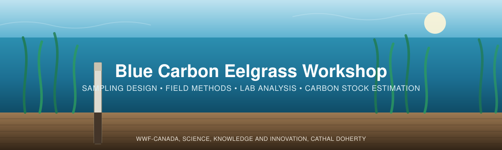
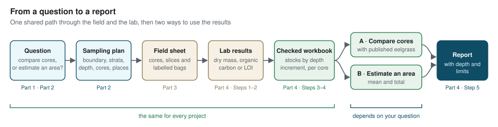
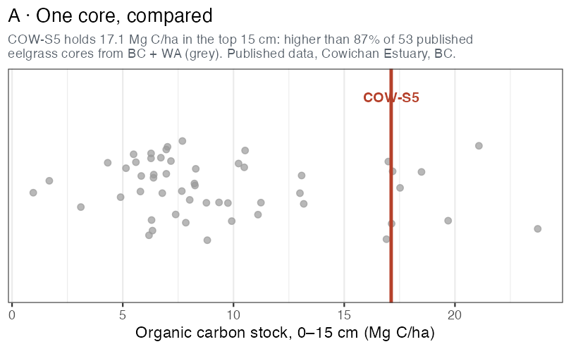
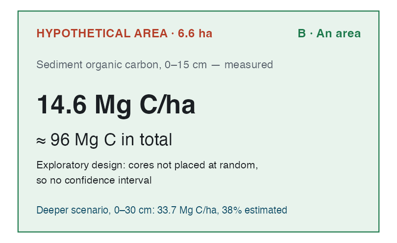

<p align="center">
  
</p>

# Blue Carbon Eelgrass Workshop

Materials from the **Blue Carbon Eelgrass Workshop** on measuring sediment carbon stocks in
seagrass/eelgrass meadows, from the background, through field methods, to
analysis and reporting

This workshop is organised in **four parts**. You can go in order, or jump to
any section you wish.

<p align="center">
  
</p>

<p align="center">
  <a href="02_Project_Planning/#before-step-1--your-question-sets-the-decisions">Question</a> ·
  <a href="02_Project_Planning/">Sampling plan</a> ·
  <a href="03_Field_Methods/#field-data-sheet">Field sheet and core</a> ·
  <a href="04_Data_Interpretation/#step-1--from-the-field-to-the-lab">Lab results</a> ·
  <a href="04_Data_Interpretation/#step-3--check-the-data">Checked workbook</a> ·
  <a href="04_Data_Interpretation/#option-a--what-do-our-samples-tell-us-and-how-do-they-compare">A: compare cores</a> ·
  <a href="04_Data_Interpretation/#option-b--what-do-our-measurements-imply-for-this-meadow">B: estimate an area</a> ·
  <a href="04_Data_Interpretation/#step-5--reporting-the-results">Report</a>
</p>

**Where it ends up** — the two kinds of result, from the worked example:

<table>
<tr>
<td width="50%">



**A · One core, compared** with published eelgrass cores. Published Cowichan data.

</td>
<td width="50%">



**B · An estimate for an area.** The boundary is **hypothetical**, drawn for teaching.

</td>
</tr>
</table>

---

## Contents

| # | Section | What it covers |
|---|---------|----------------|
| 1 | [**Background**](01_Background/) | What blue carbon is and why it matters; introduce key references (the [Howard et al. Blue Carbon Manual](https://www.thebluecarboninitiative.org/manual)); the workshop [slide deck](01_Background/BlueCarbon_EelgrassPPT_FinalV1.pdf).|
| 2 | [**Project Planning**](02_Project_Planning/) | How many samples to take and where: Intro to probability-based sampling, sampling distribution strategies, and the WWF-Canada sampling-design guide + sampling design tools. |
| 3 | [**Field Methods**](03_Field_Methods/) | Collecting sediment cores: equipment, step-by-step coring methods and coring how-to videos, and accompanying datasheets. |
| 4 | [**Data Interpretation**](04_Data_Interpretation/) | Submitting samples to a lab, reading and checking lab results, and two ways to use them: comparing your cores with each other and with published eelgrass cores, or estimating the carbon in a defined area. |


### Useful links

- **WWF-Canada Carbon Measurement library** — [wwf.ca/carbon-measurement](https://wwf.ca/carbon-measurement/)
- **Coastal Blue Carbon Field Guide** — [PDF](Coastal-Blue-Carbon-Field-Guide-FINAL.pdf) · [companion video playlist](https://www.youtube.com/playlist?list=PLLsjpJMfNDP5w78ZJNDUvMj1VoRG_qSwd)
- **Howard et al. Blue Carbon Manual** — [thebluecarboninitiative.org/manual](https://www.thebluecarboninitiative.org/manual)
- **Sampling design tools** — [interactive tool](https://blue-carbon-hub.projects.earthengine.app/) · [source code](https://github.com/WWF-Canada-SKI/Carbon-Measurement/tree/main/Blue%20Carbon/Sampling%20Design%20Tools)


---

## Objectives

The goal of the workshop is to:

1. **Learn about blue carbon in Canada** — what it is and why it matters.
2. **Learn field methods for measuring it** — how to collect and process sediment cores.
3. **Turn measurements into outputs** — convert field data into carbon analyses to inform decision making.

<!-- TODO (Cathal): add an "Eelgrass Workshop Skills Checklist" here. -->

## How to think about this workshop

This is an *eelgrass carbon* workshop: at its heart, it is about collecting the data needed to
quantify carbon in an ecosystem. The clearest way to see what a team needs to collect is to
start from the **data sheet** the analysis is built on, and work back from there. See the data sheet attached, each heading represents something
real we measure in the ecosystem, such as a depth of sediment, a weight, a carbon concentration, and
once the sheet is complete, those numbers let us calculate carbon stock, compare areas, and
inform decisions.

The workshop therefore focuses on two things, in the order you'd do them:

1. **Making the data useful** — making sure that *before* you collect anything, the samples you
   plan to take will actually answer your team's questions and contribute to your organizational
   goals.

2. **Collecting the data** following best practices, in line with what the **data sheet** asks for.

These two phrases — *making the data useful* and *collecting the data* — come back throughout the
workshop as the names for these two jobs.

Take some time to explore the data sheet in both forms: a
[blank sheet](04_Data_Interpretation/files/Eelgrass_Carbon_DigitalData_BlankSheet.xlsx) to fill
in for your own site, and a
[worked example](04_Data_Interpretation/files/Eelgrass_Carbon_DigitalData_Example.xlsx) with data
already entered so you can follow along. Throughout, the workshop covers why we collect each piece
of data, what it is, how it is measured, and how it connects to your goals.

> **Two worked examples, kept apart on purpose.** The **Tsawwassen** team that plans a survey
> (Part 2) and fills in the paper field sheet (Part 3) is **constructed for teaching** — a real
> place, but not a real team or real records. The analysis (Part 4) then switches to three
> **published eelgrass cores from the Cowichan Estuary** (Douglas et al. 2022, via Janousek et al.
> 2025). Their carbon and bulk density are published measurements; a few fields, such as dry
> weights back-calculated from bulk density, are reconstructed for teaching and labelled as such.
> The Cowichan cores did not come from the Tsawwassen sheet. See the [Worked Example](Worked_Example/).

[**Section 2 — Project Planning**](02_Project_Planning/) is the **making the data useful** component, covering how anyone can begin
designing the sampling plan so the data you'll collect is worth collecting. [**Section 3 — Field
Methods**](03_Field_Methods/) is the **collecting the data** component. It covers taking the cores that fill the
sheet. Done together, they ensure your samples are collected effectively and with best
practices — so the data best supports your project and organizational goals.
[**Section 4 — Data Interpretation**](04_Data_Interpretation/) then turns the completed sheet
into carbon estimates.

**👉 The data sheet we're building toward:** [digital data sheet (blank, .xlsx)](04_Data_Interpretation/files/Eelgrass_Carbon_DigitalData_BlankSheet.xlsx)
· the Cowichan worked copy: [`Eelgrass_Carbon_DigitalData_Example.xlsx`](04_Data_Interpretation/files/Eelgrass_Carbon_DigitalData_Example.xlsx).

| What the sheet captures | Filled in during | Covered in |
|---|---|---|
| Plot & core log (location, depths, corer) | the field | [Section 3](03_Field_Methods/) |
| Sample slices (depths, notes) | the field | [Section 3](03_Field_Methods/) |
| Lab results (weights, organic carbon or LOI) | after the lab | [Section 4](04_Data_Interpretation/) |
| Bulk density, carbon stock | calculated for you | [Section 4](04_Data_Interpretation/) |


---
# TLDR
**In a nutshell, once the sheet is filled, how carbon stock is calculated**

You [collect one sediment core](https://www.youtube.com/playlist?list=PLLsjpJMfNDP5w78ZJNDUvMj1VoRG_qSwd)
at each sampling location, then cut it into slices. Each row of the sheet is one slice. For every
slice you measure [how much sediment](https://www.youtube.com/watch?v=BuLRrFD78Fs&list=PLLsjpJMfNDP5w78ZJNDUvMj1VoRG_qSwd&index=11)
it holds (bulk density) and [how much of it is carbon](https://www.youtube.com/watch?v=_Zm9R-kGiE8),
and multiply them together. The sheet does this for every slice, sums it per core, and splits it
into standard depth increments (0–15, 15–30, 30–50, 50–100 cm) so cores of different lengths can be
compared.

<details>
<summary><b>🧮 How a slice becomes a stock</b> (click to expand)</summary>

<br>

```
Carbon stock (kg C/m²) = SOC (g/kg) × bulk density (g/cm³) × layer thickness (cm) ÷ 100
```

Higher organic carbon concentration, denser sediment (higher bulk density), and a thicker layer all
mean more carbon stored per square metre. Multiply kg C/m² by 10 for Mg C/ha.

</details>

---

## Some resources to find in this workshop

- [`BlueCarbon_EelgrassPPT_FinalV1.pptx`](01_Background/BlueCarbon_EelgrassPPT_FinalV1.pptx) — the full workshop slide deck ([PDF version](01_Background/BlueCarbon_EelgrassPPT_FinalV1.pdf)).
- [`BlueCarbon_SampleAllocation_Spreadsheet_V2.xlsx`](02_Project_Planning/BlueCarbon_SampleAllocation_Spreadsheet_V2.xlsx) — the sample-size calculator.
- [`Eelgrass_Carbon_Datasheet_v2.pdf`](03_Field_Methods/datasheets/Eelgrass_Carbon_Datasheet_v2.pdf) — the field datasheet.
- **Coastal Blue Carbon Field Guide** — [PDF](Coastal-Blue-Carbon-Field-Guide-FINAL.pdf) · [companion video playlist](https://www.youtube.com/playlist?list=PLLsjpJMfNDP5w78ZJNDUvMj1VoRG_qSwd).
- [`04_Data_Interpretation/DataAnalysisWorkflow/`](04_Data_Interpretation/DataAnalysisWorkflow/) — the R analysis workflow and its reports (Option A and Option B), with a quick start.
- **Ecosystem Carbon Accumulation Visualizer** — [cathald.github.io/CarbonAccumulationVisualizer](https://cathald.github.io/CarbonAccumulationVisualizer/)
- **WWF-Canada Blue Carbon Sampling Design Tools** — [github.com/WWF-Canada-SKI/Carbon-Measurement](https://github.com/WWF-Canada-SKI/Carbon-Measurement/tree/main/Blue%20Carbon/Sampling%20Design%20Tools)

