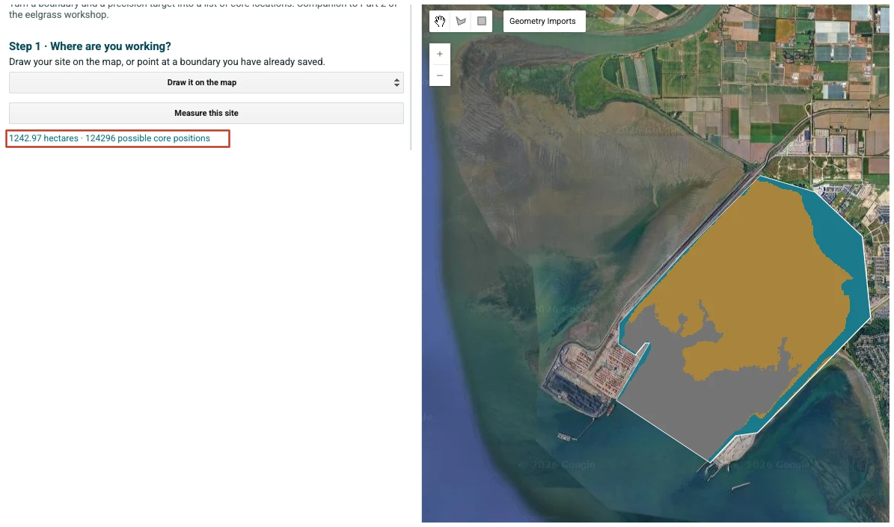
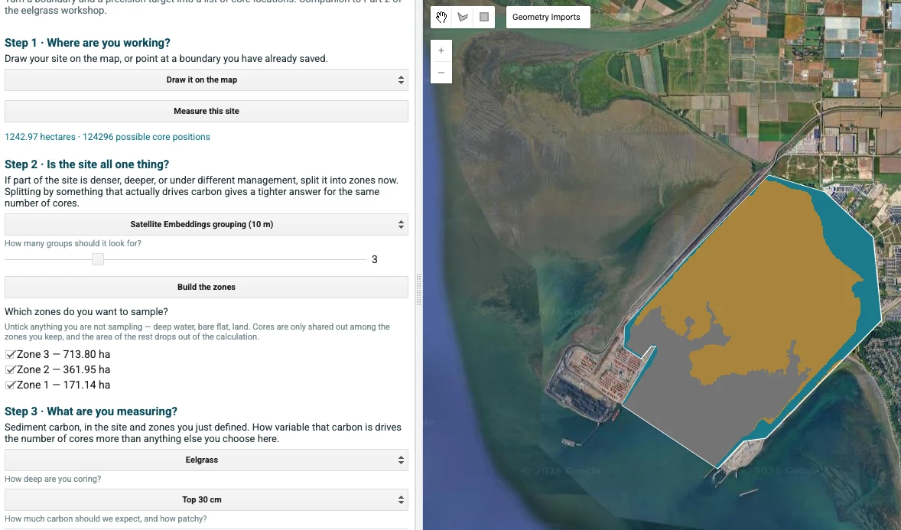
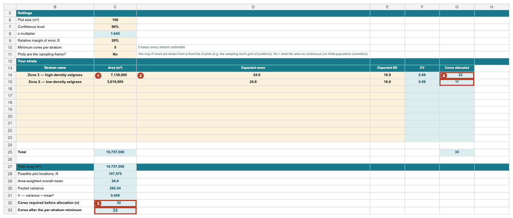
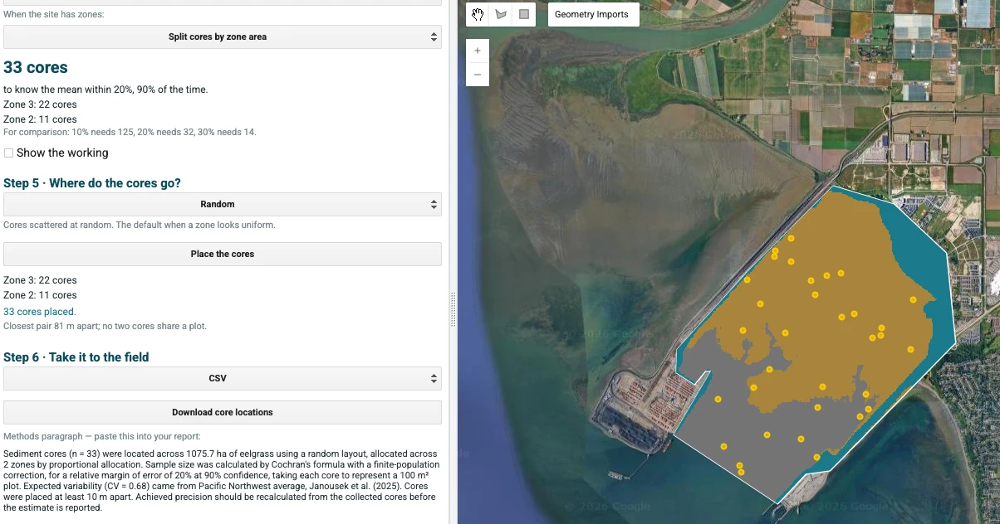

# Worked example — Part 2: Planning the Tsawwassen campaign

*How one team turned a carbon question into a field-ready sampling plan.*

[← Worked example overview](README.md) · [Back to Part 2 — Project Planning](../02_Project_Planning/)

---

## The team and their question

A small team of four working in British Columbia, assessing **baseline carbon in the
Tsawwassen Beach eelgrass meadows** before protection and restoration measures are implemented.

They want to know two things:

**A)** The **average carbon stock** across the meadow, and

**B)** How those measurements **compare** between different areas of the eelgrass, and against
future surveys, so they can tell whether management is changing the ecosystem.

Both are **Option B** questions — an estimate for a defined area, compared between its strata
— so they set the decisions Part 2 asks for before fieldwork:

| Decision | The team's choice |
|---|---|
| What is estimated | Mean sediment organic-carbon stock (Mg C ha⁻¹) and total (Mg C), per stratum and overall |
| Study boundary | The 1,242.97 ha site traced in Step 1, less the wetland edge excluded in Step 2 |
| Strata | High-density and low-density eelgrass (Step 2) |
| Reporting depth | **0–30 cm** — the depth of their prior, so every core must reach at least 30 cm |
| Sampling design | Stratified random (Step 5) |
| Precision target | ±20% at 90% confidence (Step 4) |
| Analysis | Part 4, Option B. For later surveys: keep plot IDs, coordinates and methods the same |

Which reduces to two planning questions:

1. How many samples to take
2. Where to take them

> ⚠️ **The team is constructed for teaching.** The boundary, zones and core locations below come
> from a real run of the sampling-design tool over Tsawwassen, but no cores were collected and there
> are no field records behind them. See the [worked example overview](README.md).

---

## Step 1 — Study area

Using the sampling-design tool, they chose **Draw it on the map** and traced the eelgrass flats
they could see on recent imagery. They did not survey the edge.

**Result:** a boundary polygon of **1,242.97 ha**, with room for 124,296 possible 100 m² core
positions.

---

## Step 2 — Stratify

They knew there were differences across the site, so they used the tool's automatic grouping
(**Satellite Embeddings, 10 m**, three groups).

Zone 1 traced the wetland edge around the flats rather than eelgrass, so they unticked it.

**Result:** two eelgrass strata — **high density, 713.80 ha** (Zone 3) and **low density,
361.95 ha** (Zone 2) — **1,075.75 ha** in all.

---

## Step 3 — What to measure

They only wanted to measure **sediment** carbon in this area.

**Result:** carbon pool = sediment organic carbon, reported to **30 cm**. Every core must reach at
least 30 cm; they core to the depth of refusal where they can.

---

## Step 4 — How many samples

They calculated the required number of cores from:

| Input | Value | Where it came from |
|---|---|---|
| Strata | **713.80 ha** and **361.95 ha** | Step 2 |
| Plot area | **100 m²** (10 × 10 m) | what one core represents |
| Confidence level | **90%** → $z = 1.645$ | the tool's default |
| Margin of error | **±20%** ($E = 0.20$) | the tool's default |
| Prior mean | **24.8 Mg C ha⁻¹** to 30 cm | Pacific Northwest eelgrass average, 175 cores (Janousek et al. 2025), the tool's default |
| Prior SD | **16.8** | same source |
| → $CV$ | **0.68** | $16.8 / 24.8$ — a planning scenario, not this meadow's measured variability |

Both the sampling tool and the spreadsheet calculator return **32 cores** for the whole area.
Shared out by area, with each stratum rounded up, that becomes **33**. The tool's methods paragraph
mentions a finite-population correction: it samples from its grid of possible positions, so that
is legitimate, but with 33 cores among more than 100,000 positions it changes nothing.

Padding for ~70% usable-sample recovery — attrition, lost cores, damaged samples — they planned
to collect **≈ 47**.

**Result:** 33 cores of usable data required; ~47 planned for collection.

---

## Step 5 — Where to sample

They allocated those 33 cores **proportionally across the two strata** — **22** in the
high-density zone and **11** in the low-density zone — and let the tool place them **at random
within each zone**.

**Result:** 33 coordinates, no two in the same 100 m² plot (the closest pair is 81 m apart),
downloaded as a CSV for the field team's GPS.

---

## Summary of what to expect

*Given 1,075.75 ha of eelgrass in two strata and a target of ±20% at 90% confidence, plan for
**33 cores of usable data** (about **47 collected** after padding): 22 in the high-density zone and
11 in the low-density zone.*

*If the meadow turns out patchier than the prior assumed, expect to either add cores or
report a wider interval — which is exactly why oversampling at the design stage is
worth it.*

---

## What happened next

| Stage | Where |
|---|---|
| Collecting the cores this plan specifies | [Part 3 — Field Methods](../03_Field_Methods/) |
| Lab results and carbon estimates | [Part 4 — Data Interpretation](../04_Data_Interpretation/) |
| How a filled-in data sheet and analysis look | The Cowichan worked example in [Part 4](../04_Data_Interpretation/) (published cores) |

> **Note on scale.** The plan above sizes a full campaign at **33 cores**. A first season often
> brings back fewer — which is the ordinary shape of a first field campaign, not a failure. Part 4's
> Option B reports the precision actually achieved against the ±20% target, rather than presenting
> an under-powered result as a finished one. The constructed Tsawwassen analysis that used to follow
> this plan is kept in [`archive/`](archive/) for reference.
