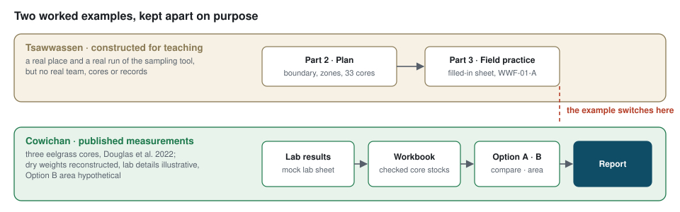

# Worked Example

*Two threads, followed end to end: planning a campaign, and analysing real cores.*

[← Back to the main guide](../README.md)

---

This folder holds the workshop's worked examples, so you can see what a finished project looks
like before (or while) you do your own. They come from two places, and they are kept apart on
purpose:

<p align="center">
  
</p>

| Stage | Example | File |
|---|---|---|
| Plan (Part 2) | Tsawwassen — constructed team, real tool run | [`02_Project_Planning.md`](02_Project_Planning.md) · [calculator copy](../02_Project_Planning/BlueCarbon_SampleAllocation_Spreadsheet_V2_Tsawwassen_Example.xlsx) |
| Field practice (Part 3) | Tsawwassen core `WWF-01-A` — constructed | [filled-in field sheet](../03_Field_Methods/datasheets/Eelgrass_Carbon_Datasheet_Example.pdf) |
| Lab results (Part 4) | Cowichan — published values, mock lab layout | [`Example_Lab_Results.xlsx`](../04_Data_Interpretation/files/Example_Lab_Results.xlsx) |
| Checked workbook (Part 4) | Cowichan — published, dry weights reconstructed | [`Eelgrass_Carbon_DigitalData_Example.xlsx`](../04_Data_Interpretation/files/Eelgrass_Carbon_DigitalData_Example.xlsx) |
| Option A and B reports (Part 4) | Cowichan — Option B area hypothetical | [Option A](../04_Data_Interpretation/DataAnalysisWorkflow/example_reports/cowichan_report_option_A.html) · [Option B](../04_Data_Interpretation/DataAnalysisWorkflow/example_reports/cowichan_report_option_B.html) |

| Part | Example | Data |
|---|---|---|
| **Planning and field practice** ([Parts 2](../02_Project_Planning/) and [3](../03_Field_Methods/)) | A team planning a baseline survey of the eelgrass at **Tsawwassen, BC** | ⚠️ **Constructed for teaching.** The site, boundary and zones come from a real run of the sampling tool; the team, its cores and its field records do not exist |
| **Analysis** ([Part 4](../04_Data_Interpretation/)) | Three eelgrass cores from the **Cowichan Estuary, BC**, followed from lab results to both analysis options | **Published measurements** (Douglas et al. 2022, via Janousek et al. 2025, CC BY 4.0), with **reconstructed** dry weights and **illustrative** lab details. The Option B area is a **hypothetical** boundary drawn for teaching |

The idea is simple: **work alongside these examples, and apply the blank templates to your own
site.**

| You want… | Use this |
|---|---|
| A completed planning example | [`02_Project_Planning.md`](02_Project_Planning.md) |
| A completed digital data sheet | [`04_Data_Interpretation/files/Eelgrass_Carbon_DigitalData_Example.xlsx`](../04_Data_Interpretation/files/Eelgrass_Carbon_DigitalData_Example.xlsx) |
| What a lab results sheet looks like | [`04_Data_Interpretation/files/Example_Lab_Results.xlsx`](../04_Data_Interpretation/files/Example_Lab_Results.xlsx) |
| A blank data sheet to fill in | [`04_Data_Interpretation/files/Eelgrass_Carbon_DigitalData_BlankSheet.xlsx`](../04_Data_Interpretation/files/Eelgrass_Carbon_DigitalData_BlankSheet.xlsx) |
| A blank sampling calculator | [`02_Project_Planning/`](../02_Project_Planning/) |
| The analysis workflow (reusable) | [`04_Data_Interpretation/DataAnalysisWorkflow/`](../04_Data_Interpretation/DataAnalysisWorkflow/) |

---

## The thread, end to end

1. **Plan** ([Part 2](../02_Project_Planning/), [walkthrough](02_Project_Planning.md)) — the
   Tsawwassen team turns its question into a reporting depth, strata, a sample size and a set of
   coordinates.
2. **Collect** ([Part 3](../03_Field_Methods/)) — the field data sheet; its filled-in example
   uses the Tsawwassen core `WWF-01-A`.
3. **Analyse** ([Part 4](../04_Data_Interpretation/)) — the Cowichan cores in the digital data
   sheet, checked, turned into core stocks, and taken through Option A and Option B:

   ```r
   source("run_option_A.R")   # from 04_Data_Interpretation/DataAnalysisWorkflow/
   source("run_option_B.R")
   ```

## Headline results (Cowichan)

| | Result |
|---|---|
| Organic carbon stock, 0–15 cm, per core (measured) | **17.1, 12.1 and 14.5 Mg C/ha** |
| Against 53 published eelgrass cores from 8 BC and Washington estuaries | 77th–87th percentile |
| Option B, **hypothetical** 6.6 ha boundary, exploratory design — measured headline | **14.6 Mg C/ha in the top 15 cm, about 96 Mg C — all measured**. No interval: the cores were not placed at random |
| Option B — deeper scenario, clearly labelled | 0–30 cm: about 34 Mg C/ha, of which 38 % is estimated below the 20 cm cores. 0–50 and 0–100 cm are not reported — the cores are too short |

The cores stop at 20 cm, so anything deeper is part estimate, and the report says how much. A
**synthetic** stratified survey in the workflow shows what a probability design adds: an
interval, and explicit handling of an unsampled stratum.

## What's here

- **[`02_Project_Planning.md`](02_Project_Planning.md)** — the planning walkthrough: how the
  Tsawwassen team went from a carbon question to a target sample size and a set of coordinates,
  step by step. Constructed teaching data.
- **[`archive/`](archive/)** — the earlier Tsawwassen analysis walkthrough and data sheet, built on
  constructed cores and the earlier pipeline. Kept for reference only.
